# CircuitSetup Energy Analyzer

CircuitSetup Energy Analyzer is a Home Assistant custom integration for analyzing energy-meter data, with first-class support for the [CircuitSetup Expandable 6 Channel ESP32 Energy Meter Main Board](https://circuitsetup.us/index.php/product/expandable-6-channel-esp32-energy-meter/) exposed through ESPHome ATM90E32 sensors. It is CircuitSetup-first, not CircuitSetup-only: it can also work with other compatible meters when they expose Home Assistant sensors for power, current, voltage, energy, frequency, reactive power, apparent power, or power factor.

The integration learns conservative per-circuit baselines for single-phase appliances, dual-phase appliances, mixed circuits, and opt-in experimental mains NILM discovery. It exposes diagnostic entities, persistent notifications for important events, and Repairs for integration or source-data problems.

## Feature Summary

- Analyzes CircuitSetup 6 Channel Energy Meter data from ESPHome ATM90E32
  sensors inside Home Assistant, plus other compatible meters that expose the
  same electrical measurements.
- Auto-discovers meter devices and energy-related sensors, with manual circuit
  assignment and override support.
- Supports single-phase circuits, dual-phase appliances, mixed circuits, and
  experimental mains NILM disaggregation.
- Learns conservative per-circuit baselines before alerting, then requires
  repeated anomalies and reports them as possible issues with observed evidence.
- Tracks active power, current, voltage, frequency, power factor, reactive
  power, apparent power, metric consistency, usage patterns, and kWh changes.
- Provides appliance-aware analysis for refrigerators, washers, dryers, HVAC
  compressor/blower loads, electric heat, water heaters, pool and water pumps,
  sump pumps, car chargers, solar/export circuits, and mains feeds.
- Adds optional usage-spike, daily goal, billing-cycle, cost, demand, breaker
  capacity, standby, always-on, solar-flow, and utility/Opower comparison
  diagnostics.
- Exposes standard Home Assistant entities, diagnostic sensors, binary sensors,
  persistent notifications, Repairs for setup/data-quality problems, a sample
  dashboard, and an alert automation blueprint.

## Summary-First Diagnostics

Most users should start with four rollup entities for each appliance or circuit:

- Health Summary (`sensor.<circuit>_health_summary`) answers whether the
  analyzer thinks the appliance is ready, learning, missing data, or showing a
  possible issue.
- Activity Summary (`sensor.<circuit>_activity_summary`) answers what the
  appliance is doing now, such as running, idle, standby, on, off, or no recent
  activity.
- Electrical Health (`sensor.<circuit>_electrical_health`) combines
  power-quality evidence, dual-phase leg imbalance, and watts/amps/VA/power
  factor consistency into one user-facing electrical condition.
- Energy Summary (`sensor.<circuit>_energy_summary`) combines daily kWh,
  energy spike, daily goal, billing-cycle, and cost evidence into one usage
  condition.

The detailed diagnostic entities are still available for advanced detail and
automations, but internal `... Status` entities are intentionally secondary. For
example, Metric Consistency Status and Leg Imbalance Status explain why a
summary changed; they do not need to be the first thing a household user sees.

New installs show only the summary-first device surface by default: Health
Summary, Activity Summary, Electrical Health, Energy Summary, Daily Energy
Usage, and appliance Running binary sensors where applicable. Everyday summary,
usage, cycle, demand, solar-flow, billing, cost, and standby entities are normal
Home Assistant entities rather than diagnostic entities. Detailed evidence and
machine-readable internals remain diagnostic, enabled for advanced users, but
hidden by default; older installs are migrated to the same quieter device-level
layout.

For power-meter interpretation, think of watts as "what is it doing right now,"
kWh as "how much did it use," amps as "how hard is the circuit being loaded,"
and power factor/reactive/apparent power as electrical evidence used by the
Electrical Health summary.

## Home Assistant Energy Dashboard Boundary

Use Home Assistant's built-in Energy Dashboard for normal energy history,
individual-device energy charts, device hierarchies, tariffs, cost display, and
energy dashboard cards. This integration should not recreate those views.

CircuitSetup Energy Analyzer adds behavior around that foundation: circuit and
appliance diagnostics, CircuitSetup/ATM90E32 data-quality checks, power-quality
relationship evidence, conservative repeated notifications, and optional
CircuitSetup-specific exports.

The `energy_dashboard_status` diagnostic sensor checks whether a circuit's
configured energy or power source has metadata that Home Assistant's Energy
Dashboard can use. Its attributes list ready entities, metadata issues, and the
recommended handoff action.

## Installation

This repository is structured for HACS as a custom integration. The integration files live under `custom_components/circuitsetup_energy_analyzer`.

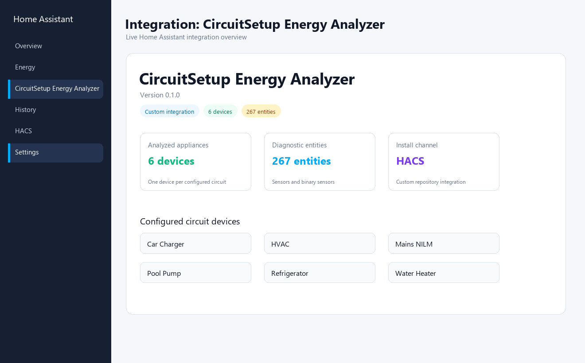

To install with HACS:

1. Open HACS.
2. Add this repository as a custom repository with category `Integration`.
3. Install CircuitSetup Energy Analyzer.
4. Restart Home Assistant.
5. Add the integration from Settings > Devices & services.

## Setup Flow

The setup and options screens are designed to avoid hand-written JSON:

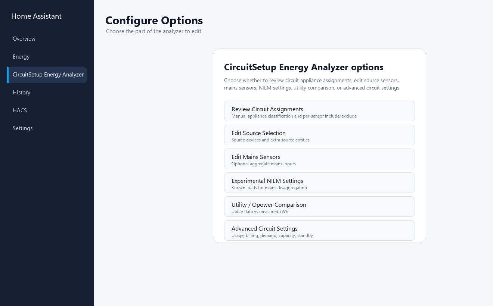

- Source Devices: choose ESPHome meter devices, such as a CircuitSetup
  ATM90E32 meter, or other compatible meter devices. The integration expands
  the selected devices into matching power, current, voltage, energy,
  frequency, reactive power, apparent power, and power-factor sensors.
- Extra Source Entities: add individual sensors that are not attached to a
  selected meter device or that you want to include manually.
- Mains Source Entities: optional whole-panel or aggregate sensors for
  experimental mains NILM and balance views. Use L1/L2 or leg A/B naming when
  split-phase mains context is available.
- Circuit Assignments: review one detected circuit group at a time, see the
  selected sensors, then confirm or change the appliance type and circuit mode.
  Turn off Include Circuit for plugs, lights, or other groups that should not
  receive appliance-specific analysis.


Recommended v1 appliance types include broad `hvac`, more specific
`hvac_compressor`, `hvac_blower`, and `electric_heat` HVAC profiles, plus
`microwave`, `washer`, `dryer`, `water_pump`, `pool_pump`, and `sump_pump`
profiles.
Existing `well_pump` input is accepted as a legacy alias for `water_pump`.

Mains sensors are optional, but they are required for the whole-home balance,
Mains NILM, solar-flow, and utility comparison features.

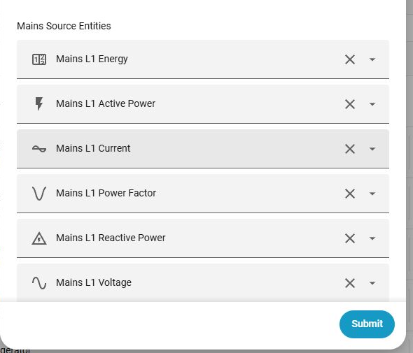

Advanced settings expose per-circuit tuning for sensitivity, usage spike
thresholds, daily goals, billing/cost settings, demand and capacity settings,
and standby/always-on behavior.

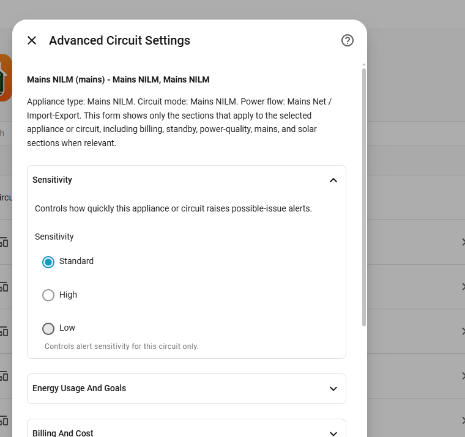

## Using The Integration

Start by treating the integration as an appliance and circuit diagnostic layer,
not as a replacement for Home Assistant's Energy Dashboard. Most users do not
need to enable every diagnostic entity. Most useful daily behavior comes from a
small set of visible rollups, then detailed evidence can stay in attributes,
notifications, Repairs, or temporary troubleshooting views.

### First-time setup checklist

1. Install the integration with HACS, restart Home Assistant, then add
   CircuitSetup Energy Analyzer from Settings > Devices & services.
2. In Source Devices, select the meter devices that provide your CT/channel
   sensors. For a CircuitSetup meter exposed through ESPHome, this is usually
   the ESPHome device that owns the ATM90E32 power, current, voltage, energy,
   power-factor, reactive-power, and apparent-power sensors.
3. Use Extra Source Entities only for sensors that are not already included by
   a selected source device. This is useful for standalone Opower, utility,
   solar, or helper sensors.
4. Leave Mains Source Entities empty unless you have whole-panel or aggregate
   mains measurements. Add mains sources when you want Mains NILM, mains
   balance, solar-flow, or utility comparison evidence.
5. Open Review Circuit Assignments. Confirm each detected group before saving:
   set Include Circuit only for circuits you want the analyzer to track, choose
   an appliance type, choose the circuit mode, and verify the selected source
   entities are really from the same circuit or appliance.
6. Save, wait for entities to appear, then build dashboards from Health
   Summary, Activity Summary, Electrical Health, Energy Summary, Daily Energy
   Usage, and the Running binary sensor.

### Classify circuits deliberately

Use Single Phase when one CT/channel tracks one primary 120 V load, such as a
refrigerator, washer, sump pump, microwave, or water pump. Use Dual Phase when
two channels are the two legs of one 240 V appliance, such as HVAC, electric
heat, water heater, dryer, oven, pool pump, or EV charger. Use Mixed when the
circuit feeds multiple unrelated loads, such as plugs and lights; mixed
circuits get conservative evidence, not appliance-specific diagnosis. Use Mains
NILM only for whole-home mains or feed circuits.

Power Flow matters when watts are signed. Use Load for normal consuming
circuits. Use Generation / Solar Export for inverter or generation circuits
where negative watts are expected. Use Mains / Net for signed whole-home mains
measurements where import and export direction both matter. If a normal load
shows sustained negative watts, check CT orientation before treating the data as
appliance evidence.

### Use it day to day

Start with these entities for each appliance:

- `Health Summary` shows whether the circuit is ready, learning, missing data, or
  showing a possible issue.
- `Activity Summary` shows what the appliance is doing now.
- `Electrical Health` shows whether power-quality, leg-balance, or metric-consistency
  evidence needs review.
- `Energy Summary` shows whether usage, goals, billing, cost, or high-usage evidence
  needs review.
- `Daily Energy Usage` shows today's derived kWh when a cumulative energy source is
  available.
- `Running` binary sensor is the easiest entity for automations like washer,
  dryer, pump, or microwave notifications.

During the first week, let the analyzer learn for at least 7 days or enough
appliance cycles before acting on behavior alerts. If a state looks confusing,
open the entity details and read `status_explanation`, `observed_evidence`, and
related attributes before changing settings. For household dashboards, keep the
summary entities visible and only expose advanced `... Status`, evidence, and
checklist entities while troubleshooting.

### Configure the optional features you actually need

Most options are set from Home Assistant Developer Tools > Actions. Choose the
`circuitsetup_energy_analyzer` action, enter the configured `circuit_id`, then
set only the values you want to change.

Common examples:

```yaml
action: circuitsetup_energy_analyzer.set_energy_goal_settings
data:
  circuit_id: hvac
  daily_goal_kwh: 12
  goal_alert_ratio: 1.0
```

```yaml
action: circuitsetup_energy_analyzer.set_capacity_settings
data:
  circuit_id: car_charger
  breaker_amps: 50
  warning_ratio: 0.8
```

```yaml
action: circuitsetup_energy_analyzer.set_standby_settings
data:
  circuit_id: refrigerator
  standby_threshold_w: 12
  always_on_alert_w: 35
```

Useful action families:

- Usage and goals: `set_energy_usage_settings`,
  `set_energy_goal_settings`.
- Billing, cost, and utility sanity checks: `set_billing_cycle_settings`,
  `set_cost_settings`, `set_utility_comparison_settings`.
- High-power circuits: `set_demand_settings`, `set_capacity_settings`,
  `set_leg_imbalance_settings`.
- Electrical evidence tuning: `set_metric_consistency_settings`,
  `set_mains_balance_settings`, `set_solar_flow_settings`.
- Appliance behavior: `set_activity_alert_settings`,
  `set_standby_settings`.
- Maintenance and alert handling: `pause_alerts`, `acknowledge_alert`,
  `relearn_baseline`, `start_maintenance`, `end_maintenance`.

### Practical examples

Washer or dryer running automation: use the Running binary sensor. Trigger when
it changes from `on` to `off` for a few minutes, then send a mobile
notification.

```yaml
alias: Washer finished
trigger:
  - platform: state
    entity_id: binary_sensor.washer_running
    from: "on"
    to: "off"
    for: "00:03:00"
action:
  - service: notify.mobile_app_phone
    data:
      message: Washer cycle appears finished.
```

Refrigerator monitoring: keep Health Summary, Activity Summary, Electrical
Health, Energy Summary, Daily Energy Usage, and Running visible. Let the
compressor cycle baseline learn before tuning alerts. If Electrical Health
changes, inspect reactive power, power factor, run-cycle evidence, and
`status_explanation` before assuming the appliance has failed.

HVAC or 240 V appliance review: classify the appliance as Dual Phase, confirm
both leg power sensors are included, and use shared mains L1/L2 voltage when
the meter does not expose per-appliance voltage. Watch Electrical Health and
Leg Imbalance. A repeated imbalance notice means "check evidence," not "replace
the equipment."

EV charger or high-current circuit: classify it as Dual Phase when both legs
are monitored, set breaker capacity with `set_capacity_settings`, and use
demand tracking if utility demand peaks matter. Capacity alerts report measured
or estimated amps relative to your configured circuit rating.

Utility or Opower comparison: configure a mains or aggregate circuit, then use
`set_utility_comparison_settings`. Provide an Opower/utility kWh entity or a
recorder statistic ID. If measured energy entities are left empty, the analyzer
sums configured load-circuit energy sensors and excludes mains and generation
circuits.

### When an alert appears

1. Read the notification text and the related summary entity first.
2. Open the entity details and review attributes such as `status_explanation`,
   observed values, thresholds, sample counts, source entities, and timestamps.
3. Persistent notifications include a Markdown link named `Open evidence graph`.
   It opens `/circuitsetup-energy-analyzer/alert-evidence`, the Alert Evidence
   dashboard section with the alert ID, circuit, and feature in the URL.
4. Before relying on that default link, create a Home Assistant dashboard with
   URL `/circuitsetup-energy-analyzer` and a view path of `alert-evidence`.
   Import or adapt `docs/dashboard-example.yaml` into that dashboard/view, or
   plan to customize the notification path later.
5. The related Alert Evidence entity exposes `evidence_path`, `graph_entities`,
   `source_entities`, `graph_window_start`, and `graph_window_end` attributes.
   Use them when dashboard cards, blueprints, or notifications need to point to
   the same context.
6. For Companion App mobile notifications, use the alert blueprint and set
   mobile notification `data.url` and Android `data.clickAction` to
   `{{ evidence_path }}` so tapping the phone notification opens the same Home
   Assistant evidence view.
7. Check easy setup causes before appliance causes: CT direction, phase pairing,
   stale sensors, wrong units, missing voltage, or a circuit assigned as the
   wrong appliance type.
8. Use Repairs for setup and data-quality problems. Use persistent
   notifications for possible appliance or circuit behavior changes.
9. If work is planned on the appliance or circuit, use `start_maintenance` or
   `pause_alerts`, then use `end_maintenance` or `relearn_baseline` when the
   system should start learning again.

### Common setup states

- `Needs data`: required source sensors are missing, stale, unavailable, or not
  yet producing usable samples.
- `Learning`: the analyzer has data, but it has not retained enough samples or
  cycles for the relevant check.
- `Waiting For Energy Change`: a cumulative kWh sensor exists, but the analyzer
  has not observed a positive energy increase yet.
- `Missing Metrics`: optional electrical metrics such as reactive power,
  apparent power, current, voltage, or power factor are not available for that
  check.
- `Possible issue`: repeated evidence crossed a configured or learned
  threshold. Read the evidence before making a diagnosis.
- Negative watts on a load: likely export power or a reversed CT. If the
  circuit is not solar/generation or signed mains, review CT orientation and
  Power Flow.

## Alert Blueprint

The repository includes a Home Assistant automation blueprint at
`blueprints/automation/circuitsetup_energy_analyzer/energy_alert_notification.yaml`.
Use it to create persistent notifications or custom follow-up actions when
selected analyzer entities report possible issue states.

## Circuit Modes

CircuitSetup Energy Analyzer supports four analysis modes:

- Single-phase circuits monitor one CT/channel mapped to one primary appliance, such as a refrigerator, freezer, washer, pump, or other 120 V load.
- Dual-phase circuits combine two CT/channels into one appliance model for 240 V loads, such as an HVAC compressor, electric heat, water heater, oven, dryer, pool pump, or car/EV charger. The analyzer keeps leg-level context so it can surface suspicious imbalance or phase-pairing problems without treating each leg as an unrelated appliance.
- Mixed circuits are useful when one branch circuit feeds multiple small loads. The integration reports data quality, large changes, and recurring evidence conservatively instead of pretending the circuit is a clean appliance signature.
- Mains NILM circuits are whole-home aggregate inputs. Experimental NILM can look for recurring aggregate signatures after known directly monitored circuits are masked out.


## Power Flow

CircuitSetup real-power sensors may report negative watts when a CT is reversed
or when a source, such as a solar inverter, is exporting power. The analyzer
tracks the raw watts separately from the analysis watts so those cases can be
handled differently:

- Load circuits treat sustained negative real power as a data-quality problem and raise a Repair suggesting CT orientation review or a different power-flow setting.
- Solar inverter circuits treat negative real power as exported generation and analyze the export magnitude.
- Mains NILM circuits keep signed net power so import and export behavior can be disaggregated without losing direction.

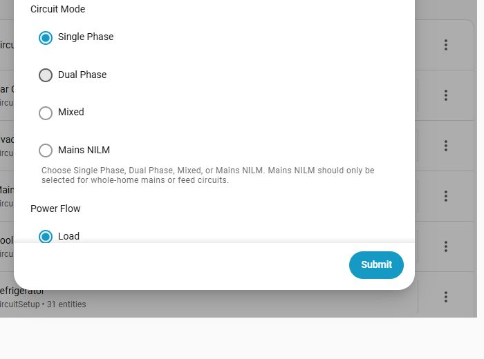

## Energy Usage Spikes

For circuits with cumulative energy sensors, the analyzer derives daily kWh
usage from the positive delta between readings. By default it compares today's
usage with the previous 7 full days. If today uses more than 25% of that
7-day total, the integration records usage-spike evidence and sends a possible
issue notification only after the condition repeats.

For example, if a refrigerator circuit used 50 kWh over the previous 7 days,
the default daily spike threshold is 12.5 kWh. If today's derived usage rises
above that threshold, the alert evidence includes today's kWh, the baseline
total, the threshold, and the percentage of the learned window used today.

The `set_energy_usage_settings` service can adjust the rolling window and daily
spike ratio for a specific circuit.


## Daily Energy Goals

For circuits with cumulative energy sensors, the analyzer can add a repeated
notification layer around a user-defined daily kWh goal. Use Home Assistant's
Energy Dashboard for the normal chart/history view; this feature is only for
per-circuit goal evidence and notices.

Use the `set_energy_goal_settings` service to set a `daily_goal_kwh` and an
optional `goal_alert_ratio`. By default, goal notices trigger at 100% of the
daily goal after repeated observations. Setting the ratio below 1.0 can warn
before the goal is reached, while setting the daily goal to 0 clears the goal.

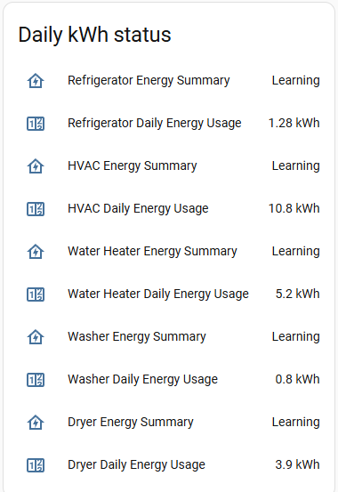

## Run Cycle Diagnostics

For appliance-style circuits, the analyzer derives today's run-cycle count,
runtime, duty cycle, and current run status from retained START/STOP event
evidence. This is intended for appliance behavior diagnostics, such as whether
a refrigerator, pump, or HVAC circuit is cycling more often or staying on longer
than expected.

These diagnostics do not replace Home Assistant's Energy Dashboard history,
energy charts, tariffs, or cost views. They are event-derived activity evidence
that can be reviewed alongside power-quality and data-quality diagnostics.

After the circuit has enough learned cycle evidence, unusually long active
runs, unusually high daily duty cycle, or unusually high starts-per-day can
create possible-issue notifications. The alert evidence reports the observed
timing, learned baseline, sample count, and confidence. It does not diagnose a
specific failed part.

For user-defined activity alerts, use the `set_activity_alert_settings` service
to set `max_active_minutes` and/or `max_idle_minutes` values. This is useful
for appliance-style "left on too long" notices, such as a pump, oven, washer,
dryer, or refrigerator compressor run that exceeds a user-selected duration, and for
"no activity for too long" notices when an expected cycling load has not run.

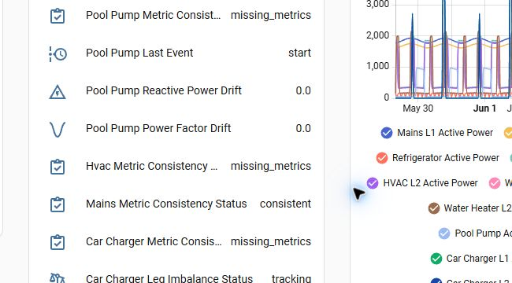

## Recent Activity Timeline

Each configured circuit exposes a compact recent-activity timeline from the
integration's retained analyzer evidence. It merges START/STOP/steady-window
events with retained possible-issue alert evidence from the last 24 hours,
sorted newest first.

Use the `recent_activity` diagnostic sensor for the latest activity title and
the sensor attributes for the detailed timeline items. The `recent_activity_count`
sensor shows how much activity was retained in the recent window. These entities
are intended for quick operational review and dashboard cards, not as a
replacement for Home Assistant recorder history or Energy Dashboard graphs.


## Billing Cycle Forecasts

The analyzer can also track circuit usage against a utility-style billing
cycle. By default the cycle starts on the first day of the month. For circuits
with cumulative energy sensors, diagnostic entities show current-cycle kWh,
projected end-of-cycle kWh, budget usage percentage, and billing-cycle status.

Use the `set_billing_cycle_settings` service to set a cycle start day and an
optional kWh budget for a circuit. When a budget is configured, projected
over-budget notifications require repeated evidence and include the current
usage, projected usage, configured budget, and billing-cycle dates.


## Cost And Time-of-Use Tracking

For circuits with cumulative energy sensors, the analyzer can estimate
billing-cycle cost from a configured electricity rate. The v1 cost model
supports a default per-kWh rate and one optional Time-of-Use period with a
different rate, time window, weekday list, and friendly name.

Use the `set_cost_settings` service to configure rates for a circuit. Cost
diagnostics show the active rate, current-cycle cost, projected end-of-cycle
cost, and whether the circuit is currently in the TOU period. These values are
estimates and do not include fixed fees, demand charges, taxes, tiered rates,
or every utility billing rule.


## History CSV Export

Use the `export_history_csv` service to build a CSV snapshot of retained
analyzer history for one configured circuit. The v1 export includes daily kWh
usage rows, daily demand peaks, standby samples, billing-cycle usage, and
cost-cycle rows when those features have retained data for the selected
circuit.

The export is generated from the integration's retained analyzer history, not
from Home Assistant's full recorder database. The current service stores the
latest CSV snapshot in runtime state so future UI, diagnostics, or download
surfaces can reuse the same export builder without writing arbitrary files from
a service call.

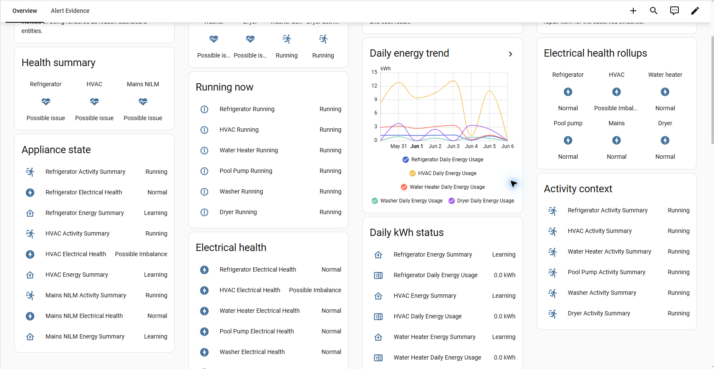

## Peak Demand Tracking

The analyzer also tracks rolling power demand for each circuit with real-power
data. The default demand window is 15 minutes, matching a common utility and
energy-monitoring view for peak demand. Normal entities show current rolling
demand and today's peak demand even when no alert limit is configured.

Use the `set_demand_settings` service to set a per-circuit demand window and an
optional demand limit in watts. When a limit is configured, the analyzer sends a
possible issue notification only after repeated rolling-demand observations stay
above that limit.

The demand tracker also ranks the current rolling window against retained
monthly peak-demand windows. This provides Emporia-style peak-demand awareness:
the diagnostic rank/status entities show when a circuit is near the month's top
three demand windows, and repeated near-peak observations can create a
possible-issue notification with the current demand, monthly cutoff, rank, and
window length. This is demand evidence, not a replacement for Home Assistant's
Energy Dashboard energy graphs.


## Circuit Capacity Tracking

For circuits with current sensors, the analyzer can compare measured amps with
a user-configured breaker or circuit rating. This is useful for car/EV chargers,
HVAC, pool pumps, water heaters, ovens, workshops, and other loads where amps
are easier to reason about than watts. If a current sensor is unavailable, the
analyzer can estimate current from real power and voltage when both are present.

Use the `set_capacity_settings` service to set `breaker_amps` and an optional
`warning_ratio` for a circuit. The default warning ratio is 0.8, so a 40 A
circuit warns at 32 A after repeated observations. Normal entities show
capacity usage percentage and status. Alerts report the observed amps, the
configured circuit rating, the warning threshold, and whether the value came
from a current sensor or a power/voltage estimate.

These diagnostics are operational evidence only. They do not verify breaker,
wire, plug, appliance, or electrical-code suitability; use a qualified
electrician for circuit sizing and safety decisions.

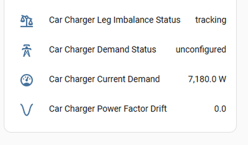

## Dual-Phase Leg Imbalance

For dual-phase circuits with leg A and leg B real-power sensors, the analyzer
tracks how far apart the two legs are while the appliance is drawing meaningful
power. This is useful for HVAC, water heaters, pool pumps, ovens, car/EV chargers,
and other 240 V loads where a large persistent difference can point to CT
pairing/orientation mistakes, phase mapping problems, or a load behavior change.

The default threshold is 50% imbalance and the default minimum observed load is
500 W total, so small control-board or idle draw is tracked but does not create
alerts. Diagnostic entities expose the current imbalance percentage, status,
dominant leg, both leg wattages, optional currents/voltages, and the threshold
used. Notifications are created only after repeated over-threshold observations
and are labeled as possible issues.


## Power Metric Consistency

When a circuit has voltage, current, apparent power, real power, and/or power
factor sensors, the analyzer compares the reported metrics with the
relationships expected from AC power measurement. It checks whether measured VA
matches voltage times current, and whether reported power factor agrees with
real power divided by apparent power. For dual-phase circuits with per-leg
voltage and current, it sums each leg's V x A instead of relying only on the
combined current.

This is a CircuitSetup/ATM90E32 data-quality diagnostic, not an energy chart.
A mismatch can point to source-entity mixups, CT/channel pairing mistakes,
incorrect units, stale/missing optional sensors, or calibration problems. The
diagnostic entities expose the expected VA, reported VA, VA percent difference,
expected PF, reported PF, PF difference, and tolerance values.


## Mains Balance

For mains/NILM circuits, the analyzer calculates an Emporia-style Balance view:
mains real power minus the sum of directly monitored load circuits. This helps
show how much power is currently unmonitored or unexplained by the circuits you
mapped. A positive balance often represents normal unmonitored lighting or plug
loads. A strongly negative balance can point to CT direction, phase pairing,
solar configuration, or multiplier problems.

Generation circuits, such as solar inverter channels, are excluded from the
monitored load sum so they do not look like household consumption.

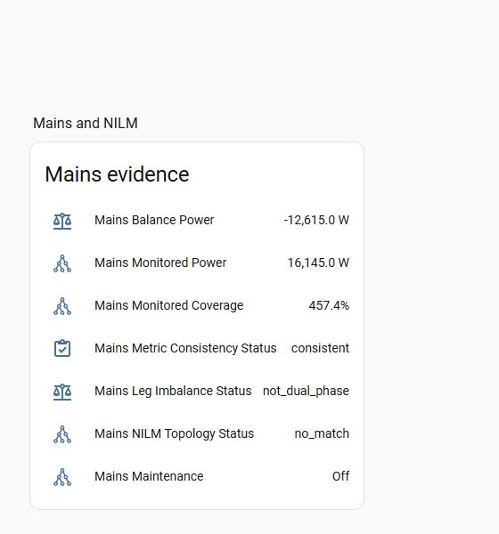

## Solar Flow Diagnostics

For homes with a signed mains/net power circuit and one or more solar inverter
circuits, the analyzer calculates instantaneous solar-flow evidence. It uses
the same convention as common solar monitoring tools: grid import is positive,
grid export is negative, and site consumption is solar generation plus signed
grid power.

Normal entities expose current solar generation, estimated site
consumption, grid import, grid export, solar self-consumption percentage, and
the percentage of current site load powered by solar. This is intended as
CircuitSetup setup and sign-convention evidence. Use Home Assistant's Energy
Dashboard solar cards for normal historical solar, return-to-grid, and
self-sufficiency views.

The analyzer also exposes instantaneous solar surplus and load-shift
opportunity diagnostics. By default, exported solar at or above 500 W is
reported as `surplus_available`, and exported solar at or above 1500 W is
reported as `high_surplus`. This is inspired by solar diverter and home energy
management tools, but it is read-only: use ordinary Home Assistant automations
if you want to turn on a car/EV charger, water heater, pool pump, or other
flexible load.

For configured car/EV charger, HVAC, pool pump, and water heater circuits, the
analyzer also estimates instantaneous net solar support for active flexible
loads and whether idle flexible loads are surplus candidates. The evidence
lists candidate circuits, active/idle/unavailable state, current power,
estimated solar coverage, and status such as `active_solar_supported`,
`active_grid_supported`, `surplus_candidate`, `solar_flow_unavailable`, or
`waiting_for_surplus`.

If export is much larger than measured solar generation, the solar-flow status
reports `inconsistent_export`, which can point to CT orientation, missing
generation channels, battery export, or a solar/mains mapping problem.

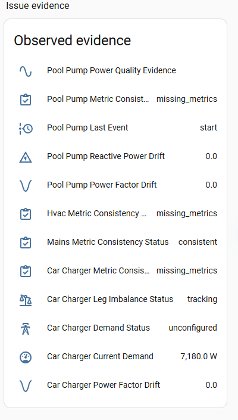

## Utility And Opower Comparison

For aggregate circuits, the analyzer can compare utility-reported kWh with a
measured same-period kWh source. This is intended for sanity-check evidence,
not normal energy history. Use Home Assistant's Energy Dashboard for standard
long-term energy charts, tariffs, costs, and device energy rollups.

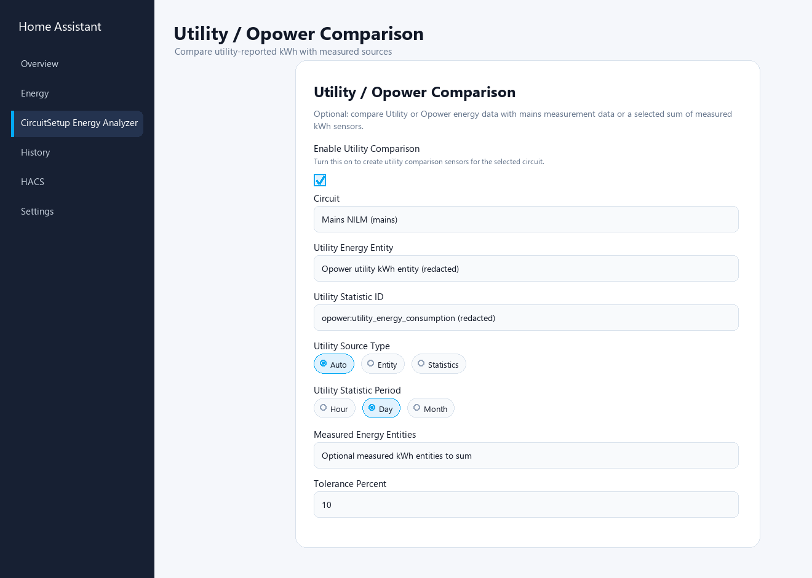

The Utility / Opower screenshot redacts account-specific utility text.

Use the `set_utility_comparison_settings` service on a mains or aggregate
circuit. Set `utility_energy_entity` to a current-bill or utility kWh sensor,
or set `utility_statistic_id` and `utility_source_type: statistics` to compare
an Opower statistic from Developer Tools > Statistics. For Opower statistics,
the default `utility_statistic_period` is `day`; use `month` if your utility
only provides monthly data.

If you also set `measured_energy_entities`, those mains kWh sensors are summed
and compared with the utility value. When an Opower/statistics source is used,
the measured sensors are read from recorder statistics over the same utility
period. If measured entities are left empty, the analyzer sums configured
load-circuit energy sensors and excludes mains and generation circuits such as
solar inverters.

The default tolerance is 10%. When the measured value repeatedly differs from
the utility value by more than the configured tolerance, the analyzer sends a
possible-issue notification with the utility kWh, measured kWh, difference,
percent difference, source entities, and tolerance. Before acting on the alert,
verify that the utility and measured sensors represent the same period; utility
integrations can update on a delay. The diagnostic evidence includes the utility
source type, statistic ID when used, measured source type, comparison period,
and utility data lag.

## Always On And Standby Tracking

For circuits with real-power sensors, the analyzer estimates an Always On load
from the lowest measured power in the recent sample window. The default window
is 48 hours, with an 8 W standby threshold used to label the latest state as
off, standby, or on.

Always On diagnostics are exposed for every configured load circuit. Alerts are
optional: set an `always_on_alert_w` limit with the `set_standby_settings`
service when a circuit has a known acceptable standby load. If the estimated
Always On load repeatedly exceeds that configured limit, the notification
reports the observed watts, window, and configured limit as possible-issue
evidence.

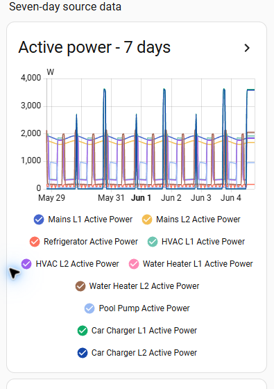

## Experimental NILM

Experimental NILM is opt-in. It can be enabled for mains aggregate channels or mixed circuits to discover recurring load signatures, but it should be treated as a hinting system rather than a diagnostic authority. Unknown signatures stay unknown until a user confirms and labels them.

When mains NILM has two real-power source channels that can be mapped to
split-phase legs, such as L1/L2 or leg A/B entity names, the analyzer keeps leg
context on recurring signatures. This lets review evidence separate likely
single-leg 120 V transitions from balanced 240 V transitions and mixed or
overlapping events. Signature payloads include leg A/B median delta watts,
dominant leg, leg balance ratio, and split-phase type such as `single_leg_a`,
`single_leg_b`, `balanced_240v`, or `imbalanced_240v_or_mixed`. These are
review clues for mapping, CT orientation, or unknown-load investigation rather
than appliance diagnoses.

When a mains NILM edge matches a configured circuit start/stop event, the
analyzer also records topology consistency evidence on that known circuit. A
single-phase circuit is expected to match one leg, while a dual-phase circuit is
expected to look like a balanced 240 V transition. Repeated conflicts create a
possible-issue alert with the observed mains topology, leg deltas, match
confidence, and configured circuit mode so the user can check mapping,
overlapping loads, or CT orientation.

For single-phase known loads, the same evidence records the observed mains leg
and a suggested leg. If the circuit already has a configured leg and repeated
high-confidence mains matches point to the other leg, the status becomes
`leg_mismatch`. The integration does not rewrite the circuit mapping; it exposes
evidence for user confirmation.

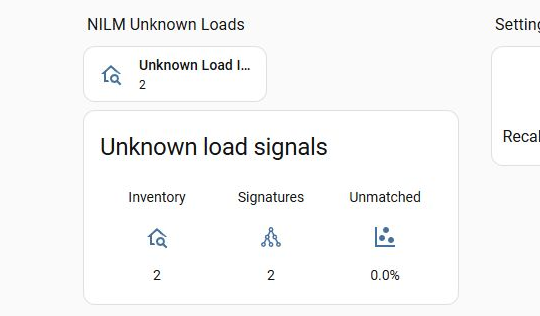

## Alert Philosophy

The analyzer is evidence-first. It learns for at least 7 days or enough profile-specific cycles before sending appliance-behavior alerts. Alerts require repeated evidence and are phrased as a possible issue or behavior change, not a diagnosis.

This means a refrigerator alert might say that cycle duration appears unusual compared with its learned baseline. It should not claim that a compressor, fan, seal, or refrigerant problem has been diagnosed.

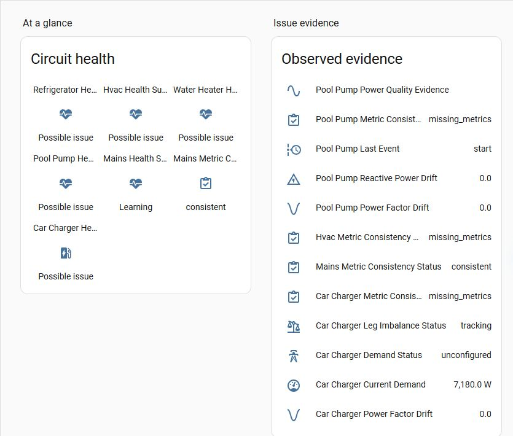

## Notifications And Repairs

Persistent notifications are reserved for important evidence about appliance behavior, such as repeated anomaly evidence after the learning period.

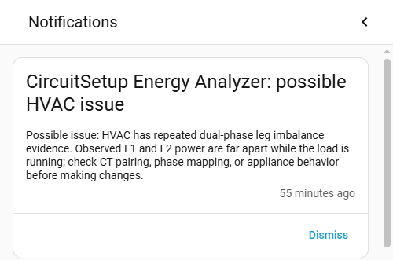

Home Assistant Repairs are used for setup, configuration, and data-quality problems: missing required sensors, stale source sensors, phase mismatch, missing mains NILM sensors, or low NILM confidence. Repairs should help fix the integration inputs before appliance analysis continues.

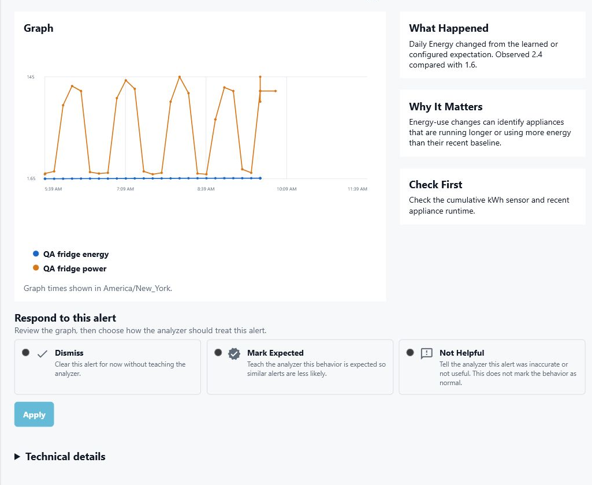

## Sensor Reference

The integration exposes standard Home Assistant diagnostic entities per
configured circuit. In the entity IDs below, `<circuit>` is the configured
circuit ID, such as `refrigerator`, `hvac`, `car_charger`, or `mains`.

The installed demo dashboard uses the visible rollup entities first, without
placing hidden diagnostic/detail entities directly on cards. If Home Assistant
shows an entity name with `(Hidden)` on a dashboard, that usually means a card
explicitly references an entity that the integration intentionally hid by
default.

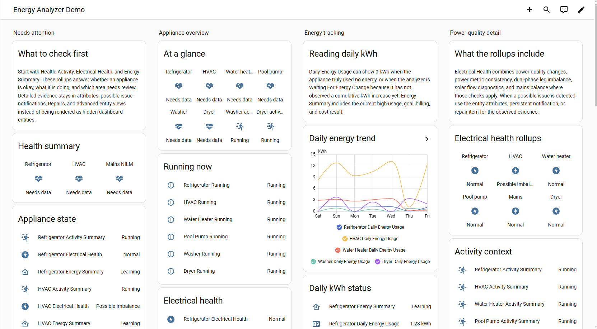

## Appliance Drilldown Pattern

For each important appliance, use the same card order so the dashboard is easy
to scan without surfacing internal detail sensors:

1. Current state: Health Summary, Activity Summary, Electrical Health, and Energy Summary.
2. Appliance automations: the Running binary sensor for on/off automation triggers.
3. Energy tracking: Daily Energy Usage plus Energy Summary, which rolls daily goals, billing, cost, and usage-spike evidence together.
4. Electrical review: Electrical Health, which rolls power quality, power metric consistency, leg imbalance, mains balance, and solar flow diagnostics together.
5. Setup and data quality: Repairs, notifications, and entity attributes for missing sensors, stale data, and advanced evidence.

This keeps the first card useful for daily use while leaving detailed evidence
available in attributes, persistent notifications, Repairs, and advanced entity
views when something looks unusual.

## Status Glossary

Status sensors display readable values in Home Assistant, such as `Missing
Metrics`, `Not Dual Phase`, or `Projected Over Budget`. For automations and
debugging, each status sensor also exposes:

- `raw_status`: the stable machine value, such as `missing_metrics`.
- `status_label`: the display label shown as the sensor state.
- `status_explanation`: a short explanation of what the state means.

Common status values:

| Display label | `raw_status` | Meaning |
| --- | --- | --- |
| Active Grid Supported | `active_grid_supported` | A flexible load is running, but current solar surplus does not cover it. |
| Active Solar Supported | `active_solar_supported` | A flexible load is running and appears to be covered by current solar surplus. |
| Apparent Power Mismatch | `apparent_power_mismatch` | Reported VA does not match the relationship expected from voltage, current, and real power. |
| Consistent | `consistent` | The available measurements are internally consistent. |
| Exporting | `exporting` | Signed mains power currently indicates grid export. |
| High Surplus | `high_surplus` | Solar export is above the configured high-surplus threshold. |
| Idle | `idle` | The circuit is below the active-load threshold for this check. |
| Imbalanced | `imbalanced` | Dual-phase leg difference is repeatedly above the configured warning threshold. |
| Importing | `importing` | Signed mains power currently indicates grid import. |
| Inconsistent Export | `inconsistent_export` | Grid export is larger than measured generation; check CT orientation, solar mapping, batteries, or missing generation channels. |
| Leg Mismatch | `leg_mismatch` | Mains NILM evidence repeatedly points to a different split-phase leg than the assignment. |
| Metric Mismatch | `metric_mismatch` | One or more power relationships changed beyond tolerance. |
| Missing Current | `missing_current` | The check needs a current sensor, or enough power and voltage data to estimate current. |
| Missing Generation | `missing_generation` | Solar-flow checks need at least one generation circuit. |
| Missing Mains | `missing_mains` | The check needs a mains, whole-home, or aggregate source. |
| Missing Measured | `missing_measured` | Utility comparison needs a measured kWh source. |
| Missing Metrics | `missing_metrics` | Metric consistency needs more matching voltage, current, real power, apparent power, or power factor sensors. |
| Missing Utility | `missing_utility` | Utility comparison needs a utility or Opower source. |
| Mismatch | `mismatch` | The measured value differs from the comparison source beyond tolerance. |
| Monthly Peak | `monthly_peak` | The current rolling demand is the highest retained monthly demand window. |
| Near Goal | `near_goal` | Daily energy usage is near the configured goal threshold. |
| Near Monthly Peak | `near_monthly_peak` | The current rolling demand is near the highest retained monthly demand windows. |
| Negative Balance | `negative_balance` | Monitored load power is higher than mains power beyond tolerance; check mapping, signs, solar, or CT orientation. |
| No Activity | `no_activity` | No recent run-cycle activity has been observed. |
| No Budget | `no_budget` | No billing-cycle budget is configured. |
| No Generation | `no_generation` | No solar generation is currently being measured. |
| No Match | `no_match` | No matching NILM event has been observed yet. |
| No Monitored Circuits | `no_monitored_circuits` | Mains balance needs at least one monitored load circuit. |
| No Surplus | `no_surplus` | No solar export surplus is currently available. |
| Not Applicable | `not_applicable` | The check does not apply to the current circuit configuration. |
| Not Dual Phase | `not_dual_phase` | The check only applies to dual-phase circuits. |
| Off | `off` | Latest power is below the configured standby threshold. |
| On | `on` | Latest power is above the standby range. |
| Over Budget | `over_budget` | Billing-cycle usage is over the configured budget. |
| Over Goal | `over_goal` | Daily energy usage is over the configured goal. |
| Over Limit | `over_limit` | The measured value is over the configured limit. |
| Over Threshold | `over_threshold` | The measured value is over the configured threshold. |
| Possible Issue | `possible_issue` | Repeated evidence has crossed an alert threshold. |
| Power Factor Mismatch | `power_factor_mismatch` | Reported power factor does not match real power divided by apparent power. |
| Projected Over Budget | `projected_over_budget` | Current usage projects above the configured billing-cycle budget. |
| Ready | `ready` | The analyzer has enough data for this check. |
| Running | `running` | The circuit is currently above the active-load threshold. |
| Self Powered | `self_powered` | Solar generation is approximately covering current site load. |
| Standby | `standby` | Latest power is within the configured standby range. |
| Surplus Available | `surplus_available` | Solar export is above the configured surplus threshold. |
| Surplus Candidate | `surplus_candidate` | An idle flexible load could be a candidate while solar surplus is available. |
| Topology Match | `topology_match` | Mains NILM evidence matches the configured circuit mode. |
| Topology Mismatch | `topology_mismatch` | Mains NILM evidence conflicts with the configured circuit mode. |
| TOU Peak | `tou_peak` | Current time is inside the configured time-of-use peak period. |
| Tracking | `tracking` | The analyzer has enough inputs and is tracking this check. |
| Unavailable | `unavailable` | This check does not have enough retained data yet. |
| Unconfigured | `unconfigured` | This optional check has not been configured. |
| Waiting For Energy Change | `waiting_for_delta` | A cumulative kWh source is present, but no positive energy increase has been observed yet. |
| Waiting For Surplus | `waiting_for_surplus` | No idle flexible load currently has enough solar surplus. |

## Core Appliance Status Sensors

Start with these entities on dashboards:

| Friendly name | Entity pattern | Purpose | Visibility | Possible outputs |
|---|---|---|---|---|
| Health Summary | `sensor.<circuit>_health_summary` | One short state for the circuit or appliance. | Default visible | `Ready`, `Learning`, `Needs data`, `Possible issue`, `Paused` |
| Activity Summary | `sensor.<circuit>_activity_summary` | Human-readable activity state with run-cycle and standby context in attributes. | Default visible | `Running`, `Idle`, `Standby`, `On`, `Off`, `No Activity` |
| Electrical Health | `sensor.<circuit>_electrical_health` | Combined electrical condition for power quality, metric consistency, dual-phase balance, mains balance, and solar flow. | Default visible | `Normal`, `Needs Metrics`, `Possible Imbalance`, `Possible Metric Mismatch`, `Possible Power Quality Change` |
| Energy Summary | `sensor.<circuit>_energy_summary` | Combined daily usage, goals, billing, cost, and high-usage evidence. | Default visible | `Normal`, `Learning`, `Needs Energy Data`, `Watch`, `High Usage` |
| Daily Energy Usage | `sensor.<circuit>_daily_energy_usage` | Current daily kWh when cumulative energy data is available. | Default visible when energy data exists | `0.0 kWh` and higher daily totals |
| Running | `binary_sensor.<circuit>_running` | Appliance on/off state for automations and notifications. | Default visible for appliance circuits with active-power sensors | `on`, `off` |

Use these advanced diagnostic entities in attributes, automations, or a
temporary troubleshooting view instead of the default dashboard:

| Friendly name | Entity pattern | Purpose | Visibility | Possible outputs |
|---|---|---|---|---|
| Readiness | `sensor.<circuit>_readiness` | Machine-readable readiness state with attributes explaining learning progress and blocked checks. | Advanced diagnostic, hidden by default | `learning`, `ready`, `needs_data`, `paused`, `possible_issue` |
| Alert Evidence | `sensor.<circuit>_alert_evidence` | Strongest current evidence, written as observed behavior rather than diagnosis. | Advanced diagnostic, hidden by default | Feature names such as `reactive_power`, `cycle_duration`, `demand`, blank when quiet |
| Recent Activity | `sensor.<circuit>_recent_activity` | Most recent retained start, stop, or possible-issue event. | Advanced diagnostic, hidden by default | `No recent activity`, `start`, `stop`, issue summary text |
| Energy Usage Status | `sensor.<circuit>_energy_usage_status` | Daily kWh tracker state. | Advanced diagnostic when energy usage tracking exists | `waiting_for_delta`, `learning`, `tracking`, `over_threshold` |
| Data Quality Checklist | `sensor.<circuit>_data_quality_checklist` | Missing, stale, or invalid source-data checklist that can block analysis. | Advanced diagnostic, hidden by default | `ok`, `problem` |

Daily Energy Usage can show 0 kWh for two different reasons:

- true zero usage: the analyzer has already started tracking the cumulative kWh source and the source has not increased today.
- Waiting For Energy Change: a cumulative kWh source is present, but the analyzer has not observed a cumulative kWh increase since tracking started.

Use the `Energy Usage Status` entity and the `status_explanation` attribute to distinguish these cases.

### Source Measurement Inputs

These are the ESPHome/CircuitSetup sensors selected during setup. They may come
from a CircuitSetup ATM90E32 meter, another compatible meter, manually selected
entities, or the included demo sensors. The analyzer does not require every
source role for every appliance, but each additional role improves the evidence
it can produce.
The included demo sensors are intentionally shaped to exercise dashboard states:
HVAC has a visible split-phase/metric-consistency issue, washer and dryer are
running, the refrigerator and pump show motor-style reactive/PF behavior, and
the car charger is drawing a high but plausible load.

For single-phase appliances, use one set of source entities for the circuit.
For dual-phase appliances, use L1/L2 or leg A/B source entities where possible.
For mains, use aggregate L1/L2 sources. For solar inverters, set the circuit
Power Flow to Generation / Solar Export.

| Friendly name | Entity pattern | Purpose | Visibility | Possible outputs |
|---|---|---|---|---|
| Energy | `sensor.<appliance>_energy` | Cumulative kWh used to derive daily usage, billing-cycle usage, goals, utility comparison, and Energy Dashboard readiness. | Source input, selected during setup | Increasing `kWh` totals |
| Active Power | `sensor.<appliance>_active_power` or `sensor.<appliance>_watts` | Real power in watts used for appliance state, demand, cycles, NILM, balance, solar flow, and negative-power checks. | Source input, selected during setup | Positive load watts, negative export watts, near-zero idle watts |
| Current | `sensor.<appliance>_current` | Amps used for capacity checks, dual-phase evidence, and power metric consistency. | Source input, selected during setup | `A` readings, usually always positive even when real power is signed |
| Voltage | `sensor.mains_l1_voltage`, `sensor.mains_l2_voltage` | Line voltage used for metric consistency and current estimation. Split-phase mains L1/L2 voltage can apply to appliances instead of per-appliance voltage sensors. | Source input, selected during setup | `V` readings |
| Frequency | `sensor.<source>_frequency` | Line frequency context from the meter. | Source input, selected during setup | `Hz` readings, usually near 60 Hz in North America |
| Power Factor | `sensor.<appliance>_power_factor` | Ratio between real and apparent power, used for motor/load change evidence and metric consistency. | Source input, selected during setup | `0.0` to `1.0`, sometimes signed by source integrations |
| Reactive Power | `sensor.<appliance>_reactive_power` | VAR evidence used for motor, compressor, pump, and power-quality drift detection. | Source input, selected during setup | `var` values that can rise when inductive behavior changes |
| Apparent Power | `sensor.<appliance>_apparent_power` | VA used with watts and power factor to validate power metric relationships. | Source input, selected during setup | `VA` values, typically greater than or equal to real-power magnitude |

### Core Health, Learning, And Evidence

These sensors are created for every configured circuit, including refrigerators,
freezers, HVAC, water heaters, ovens, washers, dryers, pumps, EV chargers, mixed
circuits, mains, and solar-related circuits.
The summary sensors are normal Home Assistant entities. Learning, readiness,
data-quality, alert evidence, retained activity detail, and configuration
readbacks remain diagnostic entities.

| Friendly name | Entity pattern | Purpose | Visibility | Possible outputs |
|---|---|---|---|---|
| Anomaly Score | `sensor.<circuit>_anomaly_score` | Numeric summary of current anomaly evidence. | Advanced diagnostic, hidden by default | `0.0` when quiet; higher numbers as repeated evidence accumulates |
| Last Event | `sensor.<circuit>_last_event` | Latest retained event type. | Advanced diagnostic, hidden by default | `start`, `stop`, `steady_window`, `voltage_sag`, `voltage_swell`, `leg_imbalance`, `data_quality`, `unknown` |
| Health Summary | `sensor.<circuit>_health_summary` | Dashboard-friendly circuit state. | Default visible | `Learning`, `Ready`, `Needs data`, `Paused`, `Possible issue`, `Mixed observation`, `NILM review` |
| Activity Summary | `sensor.<circuit>_activity_summary` | User-facing activity state with run-cycle and standby detail in attributes. | Default visible | `Running`, `Idle`, `Standby`, `On`, `Off`, `No Activity` |
| Electrical Health | `sensor.<circuit>_electrical_health` | User-facing electrical condition combining power quality, dual-phase balance, and power metric consistency. | Default visible | `Normal`, `Needs Metrics`, `Possible Imbalance`, `Possible Metric Mismatch`, `Possible Power Quality Change` |
| Energy Summary | `sensor.<circuit>_energy_summary` | User-facing energy condition combining daily usage, goals, billing, and cost evidence. | Default visible | `Normal`, `Learning`, `Needs Energy Data`, `Watch`, `High Usage` |
| Readiness | `sensor.<circuit>_readiness` | Machine-readable health/readiness state with readiness attributes. | Advanced diagnostic, hidden by default | `learning`, `ready`, `needs_data`, `paused`, `possible_issue`, `mixed_observation`, `nilm_review` |
| Learning Progress | `sensor.<circuit>_learning_progress` | Percentage of learned baseline evidence. | Advanced diagnostic, hidden by default | `0` to `100%`, with learned and pending feature samples in attributes |
| Data Quality Checklist | `sensor.<circuit>_data_quality_checklist` | Input quality summary for missing, stale, or invalid source data. | Advanced diagnostic, hidden by default | `ok`, `problem` |
| Energy Dashboard Status | `sensor.<circuit>_energy_dashboard_status` | Whether configured energy or power sources have metadata usable by Home Assistant's Energy Dashboard. | Diagnostic | `ready`, `needs_energy_source`, metadata issue states |
| Alert Evidence | `sensor.<circuit>_alert_evidence` | Feature behind the latest active alert evidence. | Advanced diagnostic, hidden by default | `reactive_power`, `cycle_duration`, `demand`, `capacity`, `utility_comparison`, blank when quiet |
| Recent Activity | `sensor.<circuit>_recent_activity` | Latest human-readable activity item from retained analyzer evidence. | Advanced diagnostic, hidden by default | `No recent activity`, `start`, `stop`, possible-issue summary |
| Recent Activity Count | `sensor.<circuit>_recent_activity_count` | Count of retained activity items in the recent activity window. | Advanced diagnostic, hidden by default | Integer counts |
| Sensitivity | `sensor.<circuit>_sensitivity` | Active alert sensitivity preset for the circuit. | Diagnostic | `standard`, `high`, `low`, stored preset name |

### Appliance Behavior And Power Quality

These sensors are most useful for dedicated appliance circuits: refrigerator,
freezer, HVAC compressor, HVAC blower, electric heat, water heater, oven,
washer, dryer, pool pump, water pump, sump pump, motor loads, resistive loads, and similar
single-load circuits. Mixed circuits may expose fewer appliance-specific
signals.

| Friendly name | Entity pattern | Purpose | Visibility | Possible outputs |
|---|---|---|---|---|
| Power Quality Score | `sensor.<circuit>_power_quality_score` | Numeric score for observed voltage/current/PF/VAR/VA relationship changes. | Advanced diagnostic, hidden by default | `0.0` when quiet; higher values when relationships drift |
| Power Quality Evidence | `sensor.<circuit>_power_quality_evidence` | Text evidence for the latest power-quality relationship observation. | Advanced diagnostic, hidden by default | Blank text, baseline/learning text, possible-issue evidence |
| Reactive Power Drift | `sensor.<circuit>_reactive_power_drift` | Ratio-style drift in VAR behavior compared with baseline. | Advanced diagnostic, hidden by default | `0.0` or positive drift values |
| Apparent Power Drift | `sensor.<circuit>_apparent_power_drift` | Ratio-style drift in VA behavior compared with baseline. | Advanced diagnostic, hidden by default | `0.0` or positive drift values |
| Power Factor Drift | `sensor.<circuit>_power_factor_drift` | Ratio-style drift in power factor compared with baseline. | Advanced diagnostic, hidden by default | `0.0` or positive drift values |
| Run Cycle Count | `sensor.<circuit>_run_cycle_count` | Today's retained start count for cyclic appliances. | Normal entity for appliance circuits | Integer cycle counts |
| Run Cycle Runtime | `sensor.<circuit>_run_cycle_runtime` | Today's total active runtime from retained start/stop evidence. | Normal entity for appliance circuits | Seconds |
| Run Cycle Duty Cycle | `sensor.<circuit>_run_cycle_duty_cycle` | Percent of today spent active. | Normal entity for appliance circuits | `0` to `100%` |
| Run Cycle Status | `sensor.<circuit>_run_cycle_status` | Current cycle state used by Activity Summary and Running. | Advanced diagnostic, hidden by default | `running`, `idle`, `no_activity` |
| Metric Consistency Score | `sensor.<circuit>_metric_consistency_score` | Largest W/VA/PF consistency mismatch. | Advanced diagnostic, hidden by default | Percentage mismatch |
| Metric Consistency Status | `sensor.<circuit>_metric_consistency_status` | Relationship status between real power, apparent power, voltage, current, and power factor. | Advanced diagnostic, hidden by default | `consistent`, `idle`, `missing_metrics`, `apparent_power_mismatch`, `power_factor_mismatch`, `metric_mismatch` |

### Energy Usage, Goals, Billing, And Cost

These sensors require cumulative energy inputs. They are useful for appliances
where usage over a day or billing cycle matters, such as refrigerators, washers,
dryers, HVAC, water heaters, pool pumps, EV chargers, ovens, and other large loads.
Use Home Assistant's Energy Dashboard for normal energy history; these entities
exist for analyzer evidence and alerts.

| Friendly name | Entity pattern | Purpose | Visibility | Possible outputs |
|---|---|---|---|---|
| Daily Energy Usage | `sensor.<circuit>_daily_energy_usage` | kWh derived from today's positive energy delta. | Default visible when energy data exists | `kWh` |
| Energy Usage Share | `sensor.<circuit>_energy_usage_share` | Today's usage as a percent of the learned rolling energy window. | Normal entity when energy tracking exists | Percentage values |
| Energy Usage Status | `sensor.<circuit>_energy_usage_status` | Daily spike tracker state. | Advanced diagnostic when energy tracking exists | `waiting_for_delta`, `learning`, `tracking`, `over_threshold` |
| Energy Goal Usage | `sensor.<circuit>_energy_goal_usage` | Today's usage as a percent of the configured daily goal. | Normal entity when a goal is configured | Percentage values |
| Energy Goal Status | `sensor.<circuit>_energy_goal_status` | Daily goal tracker state. | Normal entity when a goal is configured | `unconfigured`, `tracking`, `near_goal`, `over_goal` |
| Billing Cycle Usage | `sensor.<circuit>_billing_cycle_usage` | Current billing-cycle usage for the circuit. | Normal entity when billing tracking exists | `kWh` |
| Billing Cycle Forecast | `sensor.<circuit>_billing_cycle_forecast` | Projected end-of-cycle usage based on current pace. | Normal entity when billing tracking exists | `kWh` |
| Billing Cycle Budget Usage | `sensor.<circuit>_billing_cycle_budget_usage` | Current or projected budget usage percentage. | Normal entity when a budget is configured | Percentage values |
| Billing Cycle Status | `sensor.<circuit>_billing_cycle_status` | Billing-cycle budget state. | Normal entity when billing tracking exists | `no_budget`, `tracking`, `over_budget`, `projected_over_budget` |
| Cost Current Rate | `sensor.<circuit>_cost_current_rate` | Active cost rate for the circuit. | Normal entity when cost tracking exists | Decimal currency-per-kWh values |
| Cost Cycle | `sensor.<circuit>_cost_cycle` | Current cycle cost estimate. | Normal entity when cost tracking exists | Numeric cost estimates |
| Cost Cycle Forecast | `sensor.<circuit>_cost_cycle_forecast` | Projected end-of-cycle cost estimate. | Normal entity when cost tracking exists | Numeric cost estimates |
| Cost Status | `sensor.<circuit>_cost_status` | Cost tracker state. | Normal entity when cost tracking exists | `unconfigured`, `tracking`, `tou_peak` |

### High-Power, Dual-Phase, And Capacity Loads

These sensors are aimed at HVAC compressors, electric heat, water heaters,
ovens, dryers, pool pumps, water pumps, sump pumps, EV chargers, mains feeds,
and other high-power circuits. Capacity sensors require either current sensors
or real power plus voltage, and a configured breaker/capacity setting.

| Friendly name | Entity pattern | Purpose | Visibility | Possible outputs |
|---|---|---|---|---|
| Current Demand | `sensor.<circuit>_current_demand` | Current rolling average demand. | Normal entity when demand tracking exists | Watts |
| Peak Demand | `sensor.<circuit>_peak_demand` | Highest rolling demand observed today. | Normal entity when demand tracking exists | Watts |
| Demand Limit Usage | `sensor.<circuit>_demand_limit_usage` | Current demand as a percent of configured demand limit. | Normal entity when a limit is configured | Percentage values |
| Demand Peak Rank | `sensor.<circuit>_demand_peak_rank` | Rank of the current rolling demand among retained monthly peak windows. | Normal entity when demand tracking exists | `0` when unavailable; integer ranks such as `1`, `2`, `3` |
| Demand Peak Status | `sensor.<circuit>_demand_peak_status` | Whether current demand is notable for the month. | Advanced diagnostic, hidden by default | `unavailable`, `below_monthly_peak`, `near_monthly_peak`, `monthly_peak` |
| Demand Status | `sensor.<circuit>_demand_status` | Demand tracker state. | Advanced diagnostic, hidden by default | `unconfigured`, `tracking`, over-limit evidence states |
| Circuit Capacity Usage | `sensor.<circuit>_capacity_usage` | Current amps as a percent of configured circuit capacity. | Normal entity when capacity is configured | Percentage values |
| Circuit Capacity Status | `sensor.<circuit>_capacity_status` | Capacity tracker state. | Advanced diagnostic, hidden by default | `unconfigured`, `missing_current`, `tracking`, `over_limit` |
| Leg Imbalance | `sensor.<circuit>_leg_imbalance` | Difference between dual-phase legs while load is meaningful. | Normal entity for dual-phase circuits | Percentage imbalance |
| Leg Imbalance Status | `sensor.<circuit>_leg_imbalance_status` | Split-phase balance state. | Advanced diagnostic, hidden by default | `not_dual_phase`, `missing_leg_power`, `idle`, `tracking`, `imbalanced` |

### Mains NILM, Balance, Solar, And Utility Comparison

These sensors apply mainly to whole-home mains circuits, Mains NILM circuits,
and homes with solar inverter or generation circuits.

| Friendly name | Entity pattern | Purpose | Visibility | Possible outputs |
|---|---|---|---|---|
| NILM Discovered Signatures | `sensor.<circuit>_nilm_discovered_signatures` | Count of recurring aggregate NILM signatures. | Normal entity for Mains NILM circuits | Integer counts |
| NILM Unmatched Load Percentage | `sensor.<circuit>_nilm_unmatched_load_percentage` | Percent of aggregate load not matched to known monitored circuits. | Normal entity for Mains NILM circuits | `0` to `100%` or higher during inconsistent mapping |
| NILM Topology Status | `sensor.<circuit>_nilm_topology_status` | Mains topology evidence for known-load matches. | Advanced diagnostic, hidden by default | `no_match`, `topology_match`, `topology_mismatch`, `leg_mismatch` |
| Balance Power | `sensor.<circuit>_balance_power` | Mains real power minus summed monitored load power. | Normal entity for mains circuits | Watts; positive is unmonitored load; strongly negative can suggest mapping or sign issues |
| Monitored Power | `sensor.<circuit>_monitored_power` | Sum of directly monitored non-generation load circuits. | Normal entity for mains circuits | Watts |
| Monitored Coverage | `sensor.<circuit>_monitored_coverage` | Percent of mains power covered by monitored circuits. | Normal entity for mains circuits | Percentage values |
| Balance Status | `sensor.<circuit>_balance_status` | Mains balance state. | Advanced diagnostic, hidden by default | `missing_mains`, `tracking`, `negative_balance` |
| Solar Generation Power | `sensor.<circuit>_solar_generation_power` | Instantaneous solar generation. | Normal entity for solar/generation circuits | Watts |
| Solar Site Consumption Power | `sensor.<circuit>_solar_site_consumption_power` | Estimated site consumption from solar generation plus signed grid power. | Normal entity for solar/generation circuits | Watts |
| Solar Grid Import Power | `sensor.<circuit>_solar_grid_import_power` | Current grid import. | Normal entity for solar/generation circuits | Watts |
| Solar Grid Export Power | `sensor.<circuit>_solar_grid_export_power` | Current grid export. | Normal entity for solar/generation circuits | Watts |
| Solar Self Consumption | `sensor.<circuit>_solar_self_consumption` | Percent of generated solar consumed on site. | Normal entity for solar/generation circuits | Percentage values |
| Solar Powered | `sensor.<circuit>_solar_powered` | Percent of current site load powered by solar. | Normal entity for solar/generation circuits | Percentage values |
| Solar Flow Status | `sensor.<circuit>_solar_flow_status` | Instantaneous solar-flow state. | Normal entity for solar/generation circuits | `missing_mains`, `missing_generation`, `no_generation`, `importing`, `exporting`, `self_powered`, `inconsistent_export` |
| Solar Surplus Power | `sensor.<circuit>_solar_surplus_power` | Exported solar available as surplus. | Normal entity for solar/generation circuits | Watts |
| Solar Load Shift Power | `sensor.<circuit>_solar_load_shift_power` | Surplus power above the configured load-shift threshold. | Normal entity for solar/generation circuits | Watts |
| Solar Flexible Load Power | `sensor.<circuit>_solar_flexible_load_power` | Current power used by flexible loads such as EV chargers, water heaters, HVAC, or pool pumps. | Normal entity for solar/generation circuits | Watts |
| Solar Flexible Load Coverage | `sensor.<circuit>_solar_flexible_load_coverage` | Percent of active flexible-load power estimated to be solar-covered. | Normal entity for solar/generation circuits | Percentage values |
| Solar Load Shift Status | `sensor.<circuit>_solar_load_shift_status` | Flexible-load solar support state. | Normal entity for solar/generation circuits | `not_applicable`, `waiting_for_surplus`, `surplus_candidate`, `active_solar_supported`, `active_grid_supported` |
| Solar Surplus Status | `sensor.<circuit>_solar_surplus_status` | Solar surplus state. | Normal entity for solar/generation circuits | `missing_mains`, `missing_generation`, `no_generation`, `no_surplus`, `surplus_available`, `high_surplus`, `inconsistent_export` |
| Utility Comparison Difference | `sensor.<circuit>_utility_comparison_difference` | Difference between measured and utility/Opower kWh. | Normal entity when utility comparison exists | Percentage difference |
| Utility Comparison Status | `sensor.<circuit>_utility_comparison_status` | Utility comparison state. | Normal entity when utility comparison exists | `unconfigured`, `missing_utility`, `missing_measured`, `tracking`, `mismatch` |

### Standby And Always-On Loads

These sensors apply to non-mains load circuits with real-power data. They are
especially useful for refrigerators, freezers, pumps, HVAC blower circuits,
motor loads, and any appliance with known standby behavior.

| Friendly name | Entity pattern | Purpose | Visibility | Possible outputs |
|---|---|---|---|---|
| Always On Power | `sensor.<circuit>_always_on_power` | Lowest retained power level in the standby window. | Normal entity for non-mains load circuits | Watts |
| Standby Threshold | `sensor.<circuit>_standby_threshold` | Configured watts threshold separating off, standby, and on behavior. | Normal entity for non-mains load circuits | Watts |
| Standby Status | `sensor.<circuit>_standby_status` | Current standby state. | Normal entity for non-mains load circuits | `learning`, `off`, `standby`, `on` |
| Always On Limit Usage | `sensor.<circuit>_always_on_limit_usage` | Always-on estimate as a percent of configured limit. | Normal entity for non-mains load circuits | Percentage values |

### Binary Sensors

The diagnostic binary sensors are created for every configured circuit.
Operational binary sensors are created only when the circuit has the required
appliance profile and source data.

| Friendly name | Entity pattern | Purpose | Visibility | Possible outputs |
|---|---|---|---|---|
| Learning | `binary_sensor.<circuit>_learning` | On while the circuit is still learning baseline evidence. | Advanced diagnostic, hidden by default | `on`, `off` |
| Data Quality Problem | `binary_sensor.<circuit>_data_quality_problem` | On when the circuit has a current data-quality issue. | Advanced diagnostic, hidden by default | `on`, `off` |
| Maintenance | `binary_sensor.<circuit>_maintenance` | On when the circuit is marked as in maintenance. | Advanced diagnostic, hidden by default | `on`, `off` |
| Running | `binary_sensor.<circuit>_running` | Created for appliance circuits with active-power sensors, excluding mixed circuits, Mains NILM, and solar inverter feeds. Turns on when watts exceed the appliance running threshold or the cycle analyzer reports `running`. | Default visible for appliance circuits | `on`, `off` |

See `docs/dashboard-example.yaml` for a starting dashboard with Refrigerator,
HVAC, Mains NILM, and utility comparison cards.
