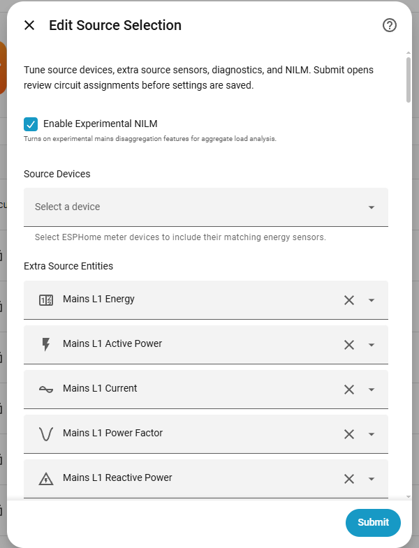

# CircuitSetup Energy Analyzer

CircuitSetup Energy Analyzer is a Home Assistant custom integration that turns circuit-level energy-meter data into useful appliance and circuit diagnostics.

[](https://my.home-assistant.io/redirect/hacs_repository/?owner=CircuitSetup&repository=CircuitSetup-Energy-Analyzer&category=Integration)

It is designed for the [CircuitSetup Expandable 6 Channel ESP32 Energy Meter Main Board](https://circuitsetup.us/index.php/product/expandable-6-channel-esp32-energy-meter/) exposed through ESPHome ATM90E32 sensors, but it can also work with other meters when they expose compatible Home Assistant sensor entities for:

- Power
- Current
- Voltage
- Energy
- Frequency
- Reactive power
- Apparent power
- Power factor

The integration does **not** replace Home Assistant's Energy Dashboard. Use the Energy Dashboard for long-term energy history, tariffs, costs, device hierarchies, and normal energy cards. Use CircuitSetup Energy Analyzer when you want to understand what your circuits and appliances are doing, whether their behavior has changed, and whether your meter data looks trustworthy.

## What you can use it for

Use this integration when you want answers like:

- Is this appliance running, idle, on standby, or not showing recent activity?
- Is today's energy use unusually high for this circuit?
- Is my refrigerator, washer, dryer, pump, HVAC, water heater, or EV charger behaving differently from its learned baseline?
- Is a 240 V appliance balanced across both legs?
- Are watts, amps, volts, VA, and power factor internally consistent?
- Is a circuit approaching a configured breaker or capacity limit?
- Which monitored circuits explain my mains power, and how much power is still unmonitored?
- Is solar being exported, self-consumed, or available for flexible loads?
- Do my measured kWh totals roughly agree with utility or Opower data?
- Are there recurring unknown whole-home load signatures worth investigating?

The analyzer is intentionally conservative. It learns before alerting, requires repeated evidence, and reports a **possible issue** or **behavior change** instead of claiming to diagnose a failed appliance part.

## What this integration is not

CircuitSetup Energy Analyzer is not:

- A replacement for Home Assistant's Energy Dashboard.
- A substitute for an electrician, appliance technician, or code-compliance review.
- A guarantee that a breaker, wire, CT, panel, or appliance is safe.
- A definitive appliance-failure diagnosis tool.
- A full NILM system that can always identify every unknown load automatically.

Treat alerts as evidence to review. Check the source entities, CT orientation, phase mapping, units, and appliance assignment before assuming the appliance is the problem.

## Requirements

You need:

- Home Assistant `2025.1.0` or newer.
- HACS, if installing through the recommended method.
- One or more energy-meter sensors already available in Home Assistant.
- For CircuitSetup meters, ESPHome entities from an ATM90E32-based meter are the expected source.
- Cumulative kWh sensors if you want daily energy, goals, billing-cycle, cost, utility comparison, or Energy Dashboard readiness checks.
- Current sensors, or power plus voltage, if you want capacity/amp checks.
- Mains or aggregate sensors if you want mains balance, experimental Mains NILM, solar-flow, or utility comparison features.
- An outdoor temperature sensor if you want HVAC weather context.

The integration works best when each important appliance or circuit has a clean group of related source sensors.

## Installation

This repository is structured as a HACS custom integration. The integration files live under:

```text
custom_components/circuitsetup_energy_analyzer
```


### Install with HACS

1. Open **HACS**.
2. Add this repository as a custom repository.
3. Choose category **Integration**.
4. Install **CircuitSetup Energy Analyzer**.
5. Restart Home Assistant.
6. Go to **Settings > Devices & services**.
7. Add **CircuitSetup Energy Analyzer**.

## Setup overview

The setup flow is designed so you do not need to hand-write JSON or edit YAML for normal configuration.


During setup, you choose:

| Setup item | What it is for |
|---|---|
| **Source Devices** | ESPHome meter devices, such as a CircuitSetup ATM90E32 meter. The integration expands selected devices into matching electrical sensors. |
| **Extra Source Entities** | Individual sensors that are not attached to a selected source device, or sensors you want to add manually. |
| **Mains Source Entities** | Optional whole-panel or aggregate sensors used for mains balance, experimental Mains NILM, solar-flow, and utility comparison. |
| **Outdoor Temperature Entity** | Optional outdoor temperature source used only for HVAC weather context. |
| **Circuit Assignments** | The review step where you confirm which sensors belong together and how each circuit should be analyzed. |
| **Advanced Circuit Settings** | The screen used to tune thresholds, goals, billing, demand, capacity, standby, solar, and other per-circuit options after setup. |




## First-time setup checklist

1. Install the integration, restart Home Assistant, and add it from **Settings > Devices & services**.
2. In **Source Devices**, select the ESPHome meter device or other meter device that owns your CT/channel sensors.
3. Use **Extra Source Entities** only for sensors that are not already included through a selected source device.
4. Leave **Mains Source Entities** empty unless you have whole-panel or aggregate measurements.
5. Add mains sources if you want Mains NILM, mains balance, solar-flow, or utility/Opower comparison.
6. Add an outdoor temperature entity if you want HVAC activity compared with outdoor conditions.
7. Open **Review Circuit Assignments**.
8. For each detected group, confirm:
   - Whether to include the circuit.
   - The circuit name.
   - The appliance type.
   - The circuit mode.
   - The power-flow mode.
   - The selected source sensors.
9. Save the configuration.
10. Let the analyzer learn before acting on behavior alerts. Most behavior checks need at least 7 days or enough appliance cycles.
11. Use **Advanced Circuit Settings** later if you need to tune thresholds, goals, billing, demand, capacity, standby, solar-flow, or other feature settings.

## Classify circuits carefully

Correct circuit classification is the most important part of setup.

| Mode | Use for | Notes |
|---|---|---|
| **Single Phase** | One CT/channel tracking one main 120 V load, such as a refrigerator, washer, sump pump, microwave, or water pump. | Best for dedicated appliance circuits. |
| **Dual Phase** | Two CT/channels that are the two legs of one 240 V appliance, such as HVAC, electric heat, water heater, dryer, oven, pool pump, or EV charger. | Enables leg-balance and combined-appliance analysis. |
| **Mixed** | A branch circuit with multiple unrelated loads, such as plugs and lights. | The analyzer stays conservative and avoids appliance-specific claims. |
| **Mains NILM** | Whole-home mains or feed circuits. | Required for experimental whole-home load-signature discovery. |

## Choose the right power-flow mode

Power-flow mode tells the analyzer how to interpret signed watts.

| Power flow | Use for | How negative watts are treated |
|---|---|---|
| **Load** | Normal consuming circuits. | Sustained negative watts usually mean CT orientation or configuration should be checked. |
| **Generation / Solar Export** | Solar inverter or generation circuits. | Negative power can be expected export/generation behavior. |
| **Mains / Net** | Signed whole-home mains measurements. | Import and export direction are preserved. |

If a normal load circuit shows sustained negative watts, check CT orientation before using that data as appliance evidence.

## Supported appliance profiles

Recommended appliance types include:

- `refrigerator`
- `freezer`
- `hvac`
- `hvac_compressor`
- `hvac_blower`
- `electric_heat`
- `water_heater`
- `oven`
- `microwave`
- `washer`
- `dryer`
- `pool_pump`
- `water_pump`
- `sump_pump`
- `ev_charger`
- `solar_inverter`
- `motor_load`
- `resistive_load`
- `mixed`

`well_pump` is accepted as a legacy alias for `water_pump`.

Choose the closest profile. The profile controls which checks are useful, which sensors are recommended, and how learning works.

## Start with the summary entities

Most users should build dashboards from the summary entities first. Detailed diagnostic entities are still available, but many are hidden by default so dashboards stay readable.

For a configured circuit ID such as `refrigerator`, `hvac`, or `car_charger`, the main entities follow this pattern:

| Entity | Example | What it tells you |
|---|---|---|
| **Health Summary** | `sensor.<circuit>_health_summary` | Whether the circuit is ready, learning, missing data, paused, or showing a possible issue. |
| **Activity Summary** | `sensor.<circuit>_activity_summary` | What the appliance appears to be doing now: running, idle, standby, on, off, or no recent activity. |
| **Electrical Health** | `sensor.<circuit>_electrical_health` | Combined electrical condition, including power-quality, metric-consistency, and leg-balance evidence when available. |
| **Energy Summary** | `sensor.<circuit>_energy_summary` | Combined daily usage, goal, billing, cost, and high-usage evidence. |
| **Daily Energy Usage** | `sensor.<circuit>_daily_energy_usage` | Today's derived kWh when a cumulative energy source is available. |
| **Running** | `binary_sensor.<circuit>_running` | Simple on/off running state for automations. |
| **Settings Suggestions** | `sensor.<circuit>_settings_suggestions` | Count of pending advanced-setting recommendations. Hidden by default. |

For power-meter interpretation:

- **Watts**: what the circuit is doing right now.
- **kWh**: how much energy it used over time.
- **Amps**: how hard the circuit is loaded.
- **Power factor, reactive power, and apparent power**: electrical evidence used for health and consistency checks.

## Build a useful dashboard

Start with one simple card per important appliance:

1. Activity Summary
2. Electrical Health
3. Energy Summary
4. Daily Energy Usage

Add the Running binary sensor where you want automations, such as washer finished, dryer finished, pump running, or microwave activity.

For more detail, use the included example dashboard:

```text
docs/dashboard-example.yaml
```


A good dashboard order is:

1. **Appliance status**: Activity Summary, Electrical Health, Energy Summary, Daily Energy Usage.
2. **Automations**: Running binary sensors for appliance-complete notifications.
3. **Energy tracking**: Daily Energy Usage and Energy Summary.
4. **Electrical review**: Electrical Health, plus detailed diagnostics only when needed.
5. **Setup/data quality**: Repairs, notifications, and entity attributes.

## Let the analyzer learn

During the first week, expect many entities to say `Learning`, `Needs data`, or `Waiting For Energy Change`.

The analyzer learns conservative baselines before sending behavior alerts. Depending on the feature, it needs:

- At least 7 days of retained history.
- Enough run cycles.
- Enough daily kWh samples.
- Enough steady samples for standby, demand, or power-quality checks.

If something looks confusing, open the entity details and review attributes such as:

- `status_explanation`
- `observed_evidence`
- `source_entities`
- `threshold`
- `sample_count`
- `first_seen`
- `last_seen`

Do this before changing thresholds or assuming an appliance has failed.

## Optional features

Enable and tune optional features from the integration options screen. Manual YAML editing is not required.

Go to:

**Settings > Devices & services > CircuitSetup Energy Analyzer > Configure > Advanced Circuit Settings**


Use **Advanced Circuit Settings** to configure circuit-specific options such as:

- Energy-usage spike thresholds
- Daily energy goals
- Billing-cycle settings
- Cost and Time-of-Use estimates
- Demand settings
- Circuit capacity limits
- Dual-phase leg-imbalance settings
- Metric-consistency tolerances
- Mains-balance settings
- Solar-flow thresholds
- Standby and Always On settings
- Activity-alert sensitivity

Most users should configure these options from the Home Assistant UI. Developer Tools actions are available for automations, scripts, dashboards, backups, and advanced workflows, but they are not required for normal setup.

| Feature | What it does | Needs |
|---|---|---|
| **Energy usage spikes** | Compares today's kWh with a learned rolling window and reports repeated high-usage evidence. | Cumulative energy sensor. |
| **Daily energy goals** | Lets you set a per-circuit daily kWh goal and receive repeated goal notices. | Cumulative energy sensor. |
| **Run-cycle diagnostics** | Tracks start count, runtime, duty cycle, and running state for appliance-style circuits. | Real-power data and enough cycles. |
| **HVAC weather context** | Compares HVAC runtime with similar outdoor temperatures before treating runtime as unusual. | HVAC-like circuit plus outdoor temperature sensor. |
| **Recent activity timeline** | Keeps recent start/stop/steady-window events and recent possible-issue evidence. | Configured circuit with retained evidence. |
| **Billing-cycle forecasts** | Tracks current-cycle kWh and projected end-of-cycle usage. | Cumulative energy sensor. |
| **Cost and Time-of-Use estimates** | Estimates current-cycle and projected cost from configured rates. | Cumulative energy sensor and configured rates. |
| **History CSV export** | Exports retained analyzer history for one circuit. | Retained analyzer history. |
| **Peak demand tracking** | Tracks rolling demand and today's peak demand. | Real-power data. |
| **Circuit capacity tracking** | Compares amps with a configured breaker/circuit rating. | Current sensor, or power plus voltage. |
| **Dual-phase leg imbalance** | Checks whether both legs of a 240 V appliance are behaving as expected. | Dual-phase circuit with leg A/B power. |
| **Power metric consistency** | Checks whether W, VA, V, A, and PF relationships make sense. | Voltage/current/apparent power/power factor where available. |
| **Mains balance** | Compares mains power with the sum of monitored load circuits. | Mains or aggregate source. |
| **Solar flow** | Shows solar generation, grid import/export, site consumption, surplus, and flexible-load hints. | Signed mains/net source plus solar generation circuit. |
| **Utility / Opower comparison** | Compares utility-reported kWh with measured kWh for the same period. | Utility/Opower entity or statistic plus measured energy. |
| **Always On and standby** | Estimates the low-power always-on load and current standby/on/off state. | Real-power data. |
| **Experimental NILM** | Looks for recurring unknown whole-home load signatures. | Mains aggregate source; optional known-load circuits improve results. |

## Feature notes

### Energy usage spikes

For circuits with cumulative kWh sensors, the analyzer derives daily usage from positive energy deltas. By default, it compares today's usage with a learned rolling window and treats a large repeated increase as possible issue evidence.

Use this for appliances where daily usage should usually stay within a predictable range, such as refrigerators, freezers, water heaters, HVAC, pumps, or EV charging circuits.

Configure this from:

**Settings > Devices & services > CircuitSetup Energy Analyzer > Configure > Advanced Circuit Settings**

Use the energy-usage settings to adjust the comparison window and spike threshold without editing YAML.

### Daily energy goals

Daily goals add a notification layer around a kWh target. Use Home Assistant's Energy Dashboard for normal energy charts; use this feature when you want per-circuit goal evidence.

Configure this from:

**Settings > Devices & services > CircuitSetup Energy Analyzer > Configure > Advanced Circuit Settings**

Set a daily kWh goal for the circuit. Set the goal back to `0` to clear it.

### Run-cycle diagnostics

For appliance-style circuits, the analyzer tracks today's:

- Run-cycle count
- Runtime
- Duty cycle
- Current running state

This is useful for refrigerators, freezers, pumps, HVAC, washers, dryers, and other loads where cycling behavior matters.

### HVAC weather context

HVAC runtime depends strongly on outdoor temperature. A compressor running longer on a very hot afternoon may be normal, while the same runtime on a mild day may deserve review.

Add an outdoor temperature entity during setup or later from **Configure**. Use a real outdoor sensor, weather-station sensor, or reliable outdoor helper. Indoor thermostat temperature is usually not a good source for this feature.

### Billing, cost, and Time-of-Use

Billing and cost features estimate usage and cost from analyzer-retained data. They do not include every possible utility billing rule, such as taxes, fixed fees, tiered rates, or demand charges.

Configure billing-cycle and cost settings from:

**Settings > Devices & services > CircuitSetup Energy Analyzer > Configure > Advanced Circuit Settings**

Use these estimates for household awareness and alerts, not for exact utility-bill reproduction.

### Demand and capacity

Demand tracking uses rolling average watts. Capacity tracking compares amps with a configured breaker or circuit rating.

Configure this from:

**Settings > Devices & services > CircuitSetup Energy Analyzer > Configure > Advanced Circuit Settings**

Use the demand and capacity settings to set the breaker or circuit rating, warning threshold, and demand-window behavior.

Capacity diagnostics are operational evidence only. They do not verify breaker, wire, plug, appliance, or code suitability.

### Dual-phase leg imbalance

For 240 V loads, the analyzer can compare leg A and leg B while the appliance is drawing meaningful power. Repeated imbalance can point to:

- CT pairing mistakes
- CT orientation problems
- Phase mapping problems
- Appliance behavior changes

Configure leg-imbalance settings from:

**Settings > Devices & services > CircuitSetup Energy Analyzer > Configure > Advanced Circuit Settings**

A leg imbalance alert means "review the evidence," not "replace the appliance."

### Power metric consistency

When voltage, current, watts, VA, and power factor are available, the analyzer checks whether the reported values agree with expected AC power relationships.

A mismatch can point to:

- Source-entity mixups
- CT/channel pairing mistakes
- Incorrect units
- Stale sensors
- Calibration problems

Configure metric-consistency tolerances from:

**Settings > Devices & services > CircuitSetup Energy Analyzer > Configure > Advanced Circuit Settings**

This is especially useful with CircuitSetup/ATM90E32 data because multiple electrical measurements are available per channel.

### Mains balance

Mains balance compares whole-home mains power with the sum of directly monitored load circuits.

A positive balance often represents ordinary unmonitored loads, such as lights or plug loads. A strongly negative balance can suggest CT direction, phase pairing, solar configuration, multiplier, or double-counting problems.

Configure mains-balance settings from:

**Settings > Devices & services > CircuitSetup Energy Analyzer > Configure > Advanced Circuit Settings**

### Solar flow

For homes with a signed mains/net source and solar generation circuits, the analyzer can estimate:

- Solar generation
- Site consumption
- Grid import
- Grid export
- Solar self-consumption
- Solar-powered share
- Solar surplus
- Flexible-load solar support

Configure solar-flow thresholds from:

**Settings > Devices & services > CircuitSetup Energy Analyzer > Configure > Advanced Circuit Settings**

This feature is read-only. Use ordinary Home Assistant automations if you want to turn on an EV charger, water heater, pool pump, or other flexible load when solar surplus is available.

### Utility / Opower comparison

Utility comparison checks whether utility-reported kWh roughly agrees with measured kWh over the same period.

Configure it on a mains or aggregate circuit. You can use a utility/Opower entity, a recorder statistic ID, or let the analyzer choose automatically when possible.

Utility comparison settings are available from:

**Settings > Devices & services > CircuitSetup Energy Analyzer > Configure > Advanced Circuit Settings**

Before acting on a mismatch, verify that the utility and measured sources cover the same time period. Utility integrations can update late.

### Always On and standby

For load circuits with real-power data, the analyzer estimates an Always On load from the lowest retained power level in the standby window. It can also classify the current state as off, standby, or on.

Configure this from:

**Settings > Devices & services > CircuitSetup Energy Analyzer > Configure > Advanced Circuit Settings**

Use the standby and Always On settings to set standby thresholds, Always On alert limits, and related sensitivity options.

### Experimental NILM

Experimental NILM is opt-in. It can look for recurring unknown load signatures from mains or mixed circuits, especially when known directly monitored circuits are masked out.

Unknown load estimates may include:

- Likely load type
- 120 V versus 240 V hint
- Dominant leg
- Typical W/VAR/VA
- Power factor
- Confidence
- First seen / last seen
- Running state
- Estimated runtime and kWh

These are clues, not confirmed appliance names. If multiple loads overlap, the analyzer should keep the evidence ambiguous instead of forcing a guess.

## Suggested settings

After enough history, the analyzer can suggest advanced settings based on observed evidence. These are tuning recommendations for thresholds and windows, not appliance diagnoses.

Review them from:

**Settings > Devices & services > CircuitSetup Energy Analyzer > Configure > Review Suggested Settings**

For each suggestion, you can:

| Action | Meaning |
|---|---|
| **Apply Suggestion** | Update the circuit's advanced setting. |
| **Deny Suggestion** | Suppress the same suggestion for the same evidence. |
| **Dismiss For Now** | Hide it until the evidence changes or the recommendation expires. |

You can also expose `sensor.<circuit>_settings_suggestions` if you want a dashboard-visible count of pending recommendations.

## Alerts and evidence

The analyzer uses two different Home Assistant surfaces:

| Surface | Used for |
|---|---|
| **Persistent notifications** | Important repeated evidence about appliance or circuit behavior. |
| **Repairs** | Setup, source-data, configuration, stale-sensor, CT orientation, or data-quality problems. |

When an alert appears:

1. Read the notification and related summary entity first.
2. Open the entity details.
3. Review `status_explanation`, observed values, thresholds, sample counts, source entities, and timestamps.
4. Use the **Open evidence graph** link when available.
5. Check easy setup causes before appliance causes:
   - CT direction
   - Phase pairing
   - Stale sensors
   - Wrong units
   - Missing voltage/current/PF/VA sensors
   - Wrong appliance type
   - Wrong circuit mode
   - Wrong power-flow mode
6. Use Repairs for configuration and data-quality problems.
7. If work is planned on an appliance or circuit, use maintenance or pause-alert actions before service begins.


## Alert automation blueprint

The repository includes a Home Assistant automation blueprint:

```text
blueprints/automation/circuitsetup_energy_analyzer/energy_alert_notification.yaml
```

Use it to create persistent notifications or custom follow-up actions when selected analyzer entities report possible issue states.

Companion App mobile notifications can use the `evidence_path` template variable for `data.url` and Android `data.clickAction`, so tapping the notification opens the same Home Assistant evidence view.

## Practical automations

Automations can be created from the Home Assistant automation editor. Manual YAML editing is not required for normal setup or advanced circuit settings.

The examples below show the underlying automation/action structure for users who prefer YAML or want to copy service calls into scripts, blueprints, or Developer Tools.

### Washer finished notification

Use the Running binary sensor for simple appliance-finished notifications.

```yaml
alias: Washer finished
trigger:
  - platform: state
    entity_id: binary_sensor.washer_running
    from: "on"
    to: "off"
    for: "00:03:00"
action:
  - service: notify.mobile_app_phone
    data:
      message: Washer cycle appears finished.
```

### Pause alerts during service

Use maintenance mode before servicing an appliance, replacing equipment, moving CTs, or making wiring changes that could make analyzer evidence temporarily misleading.

```yaml
action: circuitsetup_energy_analyzer.start_maintenance
data:
  circuit_id: refrigerator
  note: Cleaned coils
  duration: "02:00:00"
  relearn_on_end: false
```

End maintenance and optionally relearn:

```yaml
action: circuitsetup_energy_analyzer.end_maintenance
data:
  circuit_id: refrigerator
  relearn: true
```

### Relearn a circuit baseline

Use this after maintenance, appliance replacement, CT remapping, or any other change that makes the old learned baseline no longer useful.

```yaml
action: circuitsetup_energy_analyzer.relearn_baseline
data:
  circuit_id: refrigerator
```

## Optional Developer Tools actions

Most users should configure the analyzer from the Home Assistant UI:

**Settings > Devices & services > CircuitSetup Energy Analyzer > Configure > Advanced Circuit Settings**

The service actions below are optional. They are useful when you want to call analyzer functions from Home Assistant automations, scripts, dashboards, blueprints, or Developer Tools.

| Purpose | Actions |
|---|---|
| Usage and goals | `set_energy_usage_settings`, `set_energy_goal_settings` |
| Billing, cost, utility comparison | `set_billing_cycle_settings`, `set_cost_settings`, `set_utility_comparison_settings` |
| Demand and capacity | `set_demand_settings`, `set_capacity_settings` |
| Dual-phase and electrical checks | `set_leg_imbalance_settings`, `set_metric_consistency_settings` |
| Mains and solar | `set_mains_balance_settings`, `set_solar_flow_settings` |
| Appliance behavior | `set_activity_alert_settings`, `set_standby_settings` |
| Alert handling | `pause_alerts`, `acknowledge_alert`, `mark_alert_expected`, `mark_alert_unhelpful` |
| Maintenance | `start_maintenance`, `end_maintenance`, `relearn_baseline` |
| Experimental NILM | `label_nilm_signature`, `ignore_nilm_signature`, `mark_nilm_signature_expected`, `merge_nilm_signatures` |
| Suggested settings | `recalculate_setting_recommendations`, `apply_setting_recommendation`, `deny_setting_recommendation`, `dismiss_setting_recommendation` |
| Export and diagnostics | `export_diagnostics`, `export_history_csv`, `run_mapping_checks` |

When calling actions manually or from an automation, set `circuit_id` to the configured circuit ID, such as `refrigerator`, `hvac`, `car_charger`, or `mains`.

## Common setup states

| State | Meaning |
|---|---|
| `Needs data` | Required source sensors are missing, stale, unavailable, or not producing usable samples. |
| `Learning` | The analyzer has data but does not yet have enough retained samples or cycles. |
| `Waiting For Energy Change` | A cumulative kWh sensor exists, but the analyzer has not yet observed a positive energy increase. |
| `Missing Metrics` | Optional electrical metrics needed for a check are not available. |
| `Possible issue` | Repeated evidence crossed a configured or learned threshold. Review evidence before making a diagnosis. |
| Negative watts on a load | Usually export power or reversed CT orientation. Check power-flow mode and CT direction. |

Daily Energy Usage can show `0 kWh` for two different reasons:

1. The circuit truly has not used energy today.
2. The analyzer is still waiting to observe the first positive increase from the cumulative kWh source.

Use `sensor.<circuit>_energy_usage_status` and the `status_explanation` attribute to tell the difference.

## Source measurement inputs

These are the sensors you select during setup. The analyzer does not require every role for every appliance, but additional roles improve the evidence it can produce.

| Source role | Used for |
|---|---|
| **Energy** | Daily kWh, billing-cycle usage, goals, utility comparison, Energy Dashboard readiness. |
| **Active Power / Watts** | Appliance state, demand, cycles, NILM, balance, solar flow, negative-power checks. |
| **Current** | Capacity checks, dual-phase evidence, metric consistency. |
| **Voltage** | Metric consistency and current estimation. Split-phase mains L1/L2 voltage can help appliance circuits. |
| **Frequency** | Line-frequency context from the meter. |
| **Power Factor** | Motor/load behavior and metric consistency evidence. |
| **Reactive Power** | Motor, compressor, pump, and power-quality drift evidence. |
| **Apparent Power** | VA relationship checks with watts and power factor. |

For single-phase appliances, use one matching set of source entities.

For dual-phase appliances, use L1/L2 or leg A/B source entities where possible.

For mains, use aggregate L1/L2 sources.

For solar inverters, set circuit Power Flow to **Generation / Solar Export**.

## Output entity groups

Entity IDs use your configured circuit ID. For example, a circuit named `refrigerator` may expose entities such as:

```text
sensor.refrigerator_health_summary
sensor.refrigerator_activity_summary
sensor.refrigerator_electrical_health
sensor.refrigerator_energy_summary
sensor.refrigerator_daily_energy_usage
binary_sensor.refrigerator_running
```

Advanced diagnostic entities are often hidden by default. Enable them only when you want more detail or need them for automations.

## Sensor reference

The analyzer creates entities based on the circuit mode, appliance profile, source sensors, and enabled feature settings. Not every circuit will have every entity.

In the patterns below, `<circuit>` is the configured circuit ID, such as `refrigerator`, `hvac`, `car_charger`, `solar`, or `mains`.

### Core appliance status sensors

Start with these on dashboards.

| Friendly name | Entity pattern | What it means | When you see it | Common outputs |
|---|---|---|---|---|
| **Health Summary** | `sensor.<circuit>_health_summary` | One short state for the circuit or appliance. It rolls learning, readiness, data quality, maintenance, and possible issue evidence into one dashboard-friendly value. | Default visible for configured circuits. | `Ready`, `Learning`, `Needs data`, `Possible issue`, `Paused`, `Mixed observation`, `NILM review` |
| **Activity Summary** | `sensor.<circuit>_activity_summary` | Human-readable activity state with run-cycle and standby context in attributes. | Default visible for configured circuits. | `Running`, `Idle`, `Standby`, `On`, `Off`, `No Activity` |
| **Electrical Health** | `sensor.<circuit>_electrical_health` | Combined electrical condition for power quality, metric consistency, dual-phase balance, mains balance, and solar flow. | Default visible for configured circuits. | `Normal`, `Needs Metrics`, `Possible Imbalance`, `Possible Metric Mismatch`, `Possible Power Quality Change` |
| **Energy Summary** | `sensor.<circuit>_energy_summary` | Combined daily usage, goals, billing, cost, and high-usage evidence. | Default visible for configured circuits. | `Normal`, `Learning`, `Needs Energy Data`, `Watch`, `High Usage` |
| **Daily Energy Usage** | `sensor.<circuit>_daily_energy_usage` | Today's kWh derived from a cumulative energy source. | Visible when usable energy data exists. | `0.0 kWh` and higher daily totals |
| **Running** | `binary_sensor.<circuit>_running` | Simple appliance-running state for automations. | Visible for appliance circuits with active-power sensors. | `on`, `off` |

### Core diagnostic and evidence sensors

These help explain why a summary changed. They are useful for troubleshooting, automations, and temporary diagnostic dashboards.

| Friendly name | Entity pattern | What it means | Visibility | Common outputs |
|---|---|---|---|---|
| **Anomaly Score** | `sensor.<circuit>_anomaly_score` | Numeric summary of current repeated anomaly evidence. | Advanced diagnostic, hidden by default. | `0.0` when quiet; higher values as evidence accumulates |
| **Last Event** | `sensor.<circuit>_last_event` | Latest retained event type. | Advanced diagnostic, hidden by default. | `start`, `stop`, `steady_window`, `voltage_sag`, `voltage_swell`, `leg_imbalance`, `data_quality`, `unknown` |
| **Readiness** | `sensor.<circuit>_readiness` | Machine-readable readiness state with attributes explaining blocked or learning checks. | Advanced diagnostic, hidden by default. | `learning`, `ready`, `needs_data`, `paused`, `possible_issue`, `mixed_observation`, `nilm_review` |
| **Learning Progress** | `sensor.<circuit>_learning_progress` | Percent of baseline learning completed for the circuit. | Advanced diagnostic, hidden by default. | `0` to `100%` |
| **Data Quality Checklist** | `sensor.<circuit>_data_quality_checklist` | Missing, stale, invalid, or mismatched source-data checklist. | Advanced diagnostic, hidden by default. | `ok`, `problem` |
| **Energy Dashboard Status** | `sensor.<circuit>_energy_dashboard_status` | Whether the configured energy or power source has metadata that Home Assistant's Energy Dashboard can use. | Diagnostic. | `ready`, `needs_energy_source`, or metadata issue states |
| **Alert Evidence** | `sensor.<circuit>_alert_evidence` | Feature behind the latest active alert evidence. | Advanced diagnostic, hidden by default. | Feature names such as `reactive_power`, `cycle_duration`, `demand`, `capacity`, `utility_comparison`; blank when quiet |
| **Recent Activity** | `sensor.<circuit>_recent_activity` | Latest retained start, stop, steady-window, or possible-issue event. | Advanced diagnostic, hidden by default. | `No recent activity`, `start`, `stop`, issue summary text |
| **Recent Activity Count** | `sensor.<circuit>_recent_activity_count` | Count of retained recent activity items. | Advanced diagnostic, hidden by default. | Integer counts |
| **Sensitivity** | `sensor.<circuit>_sensitivity` | Active alert-sensitivity preset for the circuit. | Diagnostic. | `standard`, `high`, `low`, or another stored preset |
| **Settings Suggestions** | `sensor.<circuit>_settings_suggestions` | Count of pending advanced-setting recommendations. Attributes include recommendation IDs, suggested values, and evidence. | Normal entity, hidden by default. | `0`, `1`, or higher counts |

### Appliance behavior and power-quality sensors

These are most useful for dedicated appliance circuits such as refrigerators, freezers, HVAC, electric heat, water heaters, ovens, washers, dryers, pumps, EV chargers, motor loads, and resistive loads. Mixed circuits may expose fewer appliance-specific signals.

| Friendly name | Entity pattern | What it means | Visibility | Common outputs |
|---|---|---|---|---|
| **Power Quality Score** | `sensor.<circuit>_power_quality_score` | Numeric score for observed voltage, current, PF, VAR, or VA relationship changes. | Advanced diagnostic, hidden by default. | `0.0` when quiet; higher values when relationships drift |
| **Power Quality Evidence** | `sensor.<circuit>_power_quality_evidence` | Text evidence for the latest power-quality observation. | Advanced diagnostic, hidden by default. | Blank text, baseline/learning text, or possible-issue evidence |
| **Reactive Power Drift** | `sensor.<circuit>_reactive_power_drift` | Ratio-style drift in VAR behavior compared with the learned baseline. | Advanced diagnostic, hidden by default. | `0.0` or positive drift values |
| **Apparent Power Drift** | `sensor.<circuit>_apparent_power_drift` | Ratio-style drift in VA behavior compared with the learned baseline. | Advanced diagnostic, hidden by default. | `0.0` or positive drift values |
| **Power Factor Drift** | `sensor.<circuit>_power_factor_drift` | Ratio-style drift in power factor compared with the learned baseline. | Advanced diagnostic, hidden by default. | `0.0` or positive drift values |
| **Run Cycle Count** | `sensor.<circuit>_run_cycle_count` | Today's retained start count for cyclic appliances. | Normal entity for appliance circuits. | Integer cycle counts |
| **Run Cycle Runtime** | `sensor.<circuit>_run_cycle_runtime` | Today's total active runtime from retained start/stop evidence. | Normal entity for appliance circuits. | Seconds |
| **Run Cycle Duty Cycle** | `sensor.<circuit>_run_cycle_duty_cycle` | Percent of today spent active. | Normal entity for appliance circuits. | `0` to `100%` |
| **Run Cycle Status** | `sensor.<circuit>_run_cycle_status` | Current cycle state used by Activity Summary and the Running binary sensor. | Advanced diagnostic, hidden by default. | `running`, `idle`, `no_activity` |
| **Weather Context** | `sensor.<circuit>_weather_context` | HVAC weather-adjusted activity state. Attributes can include outdoor temperature, temperature bin, observed runtime, duty cycle, expected range, and explanation. | Visible for HVAC-like circuits when outdoor temperature context is configured. | `No Temperature Source`, `Learning`, `Weather Correlated`, `Above Weather-Adjusted Range` |
| **Outdoor Temperature** | `sensor.<circuit>_outdoor_temperature` | Graphable outdoor temperature value used by HVAC weather context. | Visible for HVAC-like circuits when outdoor temperature context is configured. | Numeric temperature in `°F` or `°C` |
| **Metric Consistency Score** | `sensor.<circuit>_metric_consistency_score` | Largest W/VA/PF consistency mismatch. | Advanced diagnostic, hidden by default. | Percentage mismatch |
| **Metric Consistency Status** | `sensor.<circuit>_metric_consistency_status` | Relationship status between real power, apparent power, voltage, current, and power factor. | Advanced diagnostic, hidden by default. | `consistent`, `idle`, `missing_metrics`, `apparent_power_mismatch`, `power_factor_mismatch`, `metric_mismatch` |

### Energy usage, goals, billing, and cost sensors

These require cumulative energy inputs. Use Home Assistant's Energy Dashboard for normal energy history; these entities exist for analyzer evidence, alerts, and per-circuit summaries.

| Friendly name | Entity pattern | What it means | Visibility | Common outputs |
|---|---|---|---|---|
| **Daily Energy Usage** | `sensor.<circuit>_daily_energy_usage` | Today's kWh derived from positive cumulative-energy deltas. | Default visible when energy data exists. | `kWh` |
| **Energy Usage Share** | `sensor.<circuit>_energy_usage_share` | Today's usage as a percent of the learned rolling energy window. | Normal entity when energy tracking exists. | Percentage values |
| **Energy Usage Status** | `sensor.<circuit>_energy_usage_status` | Daily kWh tracker state. Use this to tell true zero usage from "waiting for first kWh increase." | Diagnostic when energy tracking exists. | `waiting_for_delta`, `learning`, `tracking`, `over_threshold` |
| **Energy Goal Usage** | `sensor.<circuit>_energy_goal_usage` | Today's usage as a percent of the configured daily goal. | Normal entity when a goal is configured. | Percentage values |
| **Energy Goal Status** | `sensor.<circuit>_energy_goal_status` | Daily goal tracker state. | Normal entity when a goal is configured. | `unconfigured`, `tracking`, `near_goal`, `over_goal` |
| **Billing Cycle Usage** | `sensor.<circuit>_billing_cycle_usage` | Current billing-cycle kWh for the circuit. | Normal entity when billing tracking exists. | `kWh` |
| **Billing Cycle Forecast** | `sensor.<circuit>_billing_cycle_forecast` | Projected end-of-cycle kWh based on current pace. | Normal entity when billing tracking exists. | `kWh` |
| **Billing Cycle Budget Usage** | `sensor.<circuit>_billing_cycle_budget_usage` | Current or projected budget usage percentage. | Normal entity when a budget is configured. | Percentage values |
| **Billing Cycle Status** | `sensor.<circuit>_billing_cycle_status` | Billing-cycle budget state. | Normal entity when billing tracking exists. | `no_budget`, `tracking`, `over_budget`, `projected_over_budget` |
| **Cost Current Rate** | `sensor.<circuit>_cost_current_rate` | Active per-kWh cost rate for the circuit. | Normal entity when cost tracking exists. | Decimal currency-per-kWh values |
| **Cost Cycle** | `sensor.<circuit>_cost_cycle` | Current cycle cost estimate. | Normal entity when cost tracking exists. | Numeric cost estimates |
| **Cost Cycle Forecast** | `sensor.<circuit>_cost_cycle_forecast` | Projected end-of-cycle cost estimate. | Normal entity when cost tracking exists. | Numeric cost estimates |
| **Cost Status** | `sensor.<circuit>_cost_status` | Cost tracker state. | Normal entity when cost tracking exists. | `unconfigured`, `tracking`, `tou_peak` |

### Demand, capacity, and dual-phase sensors

These are aimed at high-power circuits such as HVAC, electric heat, water heaters, ovens, dryers, pool pumps, water pumps, sump pumps, EV chargers, mains feeds, and similar loads.

Capacity sensors require either current sensors or real power plus voltage, and a configured breaker or capacity value.

| Friendly name | Entity pattern | What it means | Visibility | Common outputs |
|---|---|---|---|---|
| **Current Demand** | `sensor.<circuit>_current_demand` | Current rolling average demand. | Normal entity when demand tracking exists. | Watts |
| **Peak Demand** | `sensor.<circuit>_peak_demand` | Highest rolling demand observed today. | Normal entity when demand tracking exists. | Watts |
| **Demand Limit Usage** | `sensor.<circuit>_demand_limit_usage` | Current demand as a percent of a configured demand limit. | Normal entity when a limit is configured. | Percentage values |
| **Demand Peak Rank** | `sensor.<circuit>_demand_peak_rank` | Rank of the current rolling demand among retained monthly peak windows. | Normal entity when demand tracking exists. | `0` when unavailable; integer ranks such as `1`, `2`, `3` |
| **Demand Peak Status** | `sensor.<circuit>_demand_peak_status` | Whether current demand is notable for the month. | Advanced diagnostic, hidden by default. | `unavailable`, `below_monthly_peak`, `near_monthly_peak`, `monthly_peak` |
| **Demand Status** | `sensor.<circuit>_demand_status` | Demand tracker state. | Advanced diagnostic, hidden by default. | `unconfigured`, `tracking`, over-limit evidence states |
| **Circuit Capacity Usage** | `sensor.<circuit>_capacity_usage` | Current amps as a percent of configured circuit capacity. | Normal entity when capacity is configured. | Percentage values |
| **Circuit Capacity Status** | `sensor.<circuit>_capacity_status` | Capacity tracker state. | Advanced diagnostic, hidden by default. | `unconfigured`, `missing_current`, `tracking`, `over_limit` |
| **Leg Imbalance** | `sensor.<circuit>_leg_imbalance` | Difference between dual-phase legs while the load is meaningful. | Normal entity for dual-phase circuits. | Percentage imbalance |
| **Leg Imbalance Status** | `sensor.<circuit>_leg_imbalance_status` | Split-phase balance state. | Advanced diagnostic, hidden by default. | `not_dual_phase`, `missing_leg_power`, `idle`, `tracking`, `imbalanced` |

### Mains NILM, balance, solar, and utility comparison sensors

These apply mainly to whole-home mains circuits, Mains NILM circuits, homes with solar generation, and homes using utility or Opower comparison data.

| Friendly name | Entity pattern | What it means | Visibility | Common outputs |
|---|---|---|---|---|
| **NILM Discovered Signatures** | `sensor.<circuit>_nilm_discovered_signatures` | Count of recurring aggregate NILM signatures. | Normal entity for Mains NILM circuits. | Integer counts |
| **NILM Unknown Loads** | `sensor.<circuit>_nilm_unknown_loads` | Count of recurring unknown mains NILM virtual loads. Attributes can include likely type, voltage class, dominant leg, W/VAR/VA/PF, confidence, first/last seen, running state, runtime, kWh estimates, and ambiguity evidence. | Normal entity for Mains NILM circuits. | `0`, `1`, or higher counts |
| **NILM Topology Status** | `sensor.<circuit>_nilm_topology_status` | Mains topology evidence for known-load matches. | Advanced diagnostic, hidden by default. | `no_match`, `topology_match`, `topology_mismatch`, `leg_mismatch` |
| **Balance Power** | `sensor.<circuit>_balance_power` | Mains real power minus summed monitored load power. Positive values usually mean unmonitored load; strongly negative values can suggest mapping or sign issues. | Normal entity for mains circuits. | Watts |
| **Monitored Power** | `sensor.<circuit>_monitored_power` | Sum of directly monitored non-generation load circuits. | Normal entity for mains circuits. | Watts |
| **Known Load Share** | `sensor.<circuit>_monitored_coverage` | Percent of current mains power explained by selected monitored load circuits. Low values usually mean normal unmonitored loads; values over `100%` can indicate CT sign, double-counting, solar/export, or mapping issues. | Normal entity for mains circuits. | Percentage values |
| **Balance Status** | `sensor.<circuit>_balance_status` | Mains balance state. | Advanced diagnostic, hidden by default. | `missing_mains`, `tracking`, `negative_balance` |
| **Solar Generation Power** | `sensor.<circuit>_solar_generation_power` | Instantaneous solar generation. | Normal entity for solar/generation circuits. | Watts |
| **Solar Site Consumption Power** | `sensor.<circuit>_solar_site_consumption_power` | Estimated site consumption from solar generation plus signed grid power. | Normal entity for solar/generation circuits. | Watts |
| **Solar Grid Import Power** | `sensor.<circuit>_solar_grid_import_power` | Current grid import. | Normal entity for solar/generation circuits. | Watts |
| **Solar Grid Export Power** | `sensor.<circuit>_solar_grid_export_power` | Current grid export. | Normal entity for solar/generation circuits. | Watts |
| **Solar Self Consumption** | `sensor.<circuit>_solar_self_consumption` | Percent of generated solar consumed on site. | Normal entity for solar/generation circuits. | Percentage values |
| **Solar Powered** | `sensor.<circuit>_solar_powered` | Percent of current site load powered by solar. | Normal entity for solar/generation circuits. | Percentage values |
| **Solar Flow Status** | `sensor.<circuit>_solar_flow_status` | Instantaneous solar-flow state. | Normal entity for solar/generation circuits. | `missing_mains`, `missing_generation`, `no_generation`, `importing`, `exporting`, `self_powered`, `inconsistent_export` |
| **Solar Surplus Power** | `sensor.<circuit>_solar_surplus_power` | Exported solar available as surplus. | Normal entity for solar/generation circuits. | Watts |
| **Solar Load Shift Power** | `sensor.<circuit>_solar_load_shift_power` | Surplus power above the configured load-shift threshold. | Normal entity for solar/generation circuits. | Watts |
| **Solar Flexible Load Power** | `sensor.<circuit>_solar_flexible_load_power` | Current power used by flexible loads such as EV chargers, water heaters, HVAC, or pool pumps. | Normal entity for solar/generation circuits. | Watts |
| **Solar Flexible Load Coverage** | `sensor.<circuit>_solar_flexible_load_coverage` | Percent of active flexible-load power estimated to be solar-covered. | Normal entity for solar/generation circuits. | Percentage values |
| **Solar Load Shift Status** | `sensor.<circuit>_solar_load_shift_status` | Flexible-load solar support state. | Normal entity for solar/generation circuits. | `not_applicable`, `waiting_for_surplus`, `surplus_candidate`, `active_solar_supported`, `active_grid_supported` |
| **Solar Surplus Status** | `sensor.<circuit>_solar_surplus_status` | Solar surplus state. | Normal entity for solar/generation circuits. | `missing_mains`, `missing_generation`, `no_generation`, `no_surplus`, `surplus_available`, `high_surplus`, `inconsistent_export` |
| **Utility Comparison Difference** | `sensor.<circuit>_utility_comparison_difference` | Difference between measured kWh and utility/Opower kWh. | Normal entity when utility comparison exists. | Percentage difference |
| **Utility Comparison Status** | `sensor.<circuit>_utility_comparison_status` | Utility comparison state. | Normal entity when utility comparison exists. | `unconfigured`, `missing_utility`, `missing_measured`, `tracking`, `mismatch` |

### Standby and Always On sensors

These apply to non-mains load circuits with real-power data. They are useful for refrigerators, freezers, pumps, HVAC blower circuits, motor loads, electronics, and appliances with known standby behavior.

| Friendly name | Entity pattern | What it means | Visibility | Common outputs |
|---|---|---|---|---|
| **Always On Power** | `sensor.<circuit>_always_on_power` | Lowest retained power level in the standby window. | Normal entity for non-mains load circuits. | Watts |
| **Standby Threshold** | `sensor.<circuit>_standby_threshold` | Configured watts threshold separating off, standby, and on behavior. | Normal entity for non-mains load circuits. | Watts |
| **Standby Status** | `sensor.<circuit>_standby_status` | Current standby state. | Normal entity for non-mains load circuits. | `learning`, `off`, `standby`, `on` |
| **Always On Limit Usage** | `sensor.<circuit>_always_on_limit_usage` | Always-on estimate as a percent of the configured limit. | Normal entity for non-mains load circuits. | Percentage values |

### Binary sensors

Diagnostic binary sensors are created for configured circuits. Operational binary sensors appear only when the circuit has the required profile and source data.

| Friendly name | Entity pattern | What it means | Visibility | Common outputs |
|---|---|---|---|---|
| **Learning** | `binary_sensor.<circuit>_learning` | On while the circuit is still learning baseline evidence. | Advanced diagnostic, hidden by default. | `on`, `off` |
| **Data Quality Problem** | `binary_sensor.<circuit>_data_quality_problem` | On when the circuit has a current source-data quality issue. | Advanced diagnostic, hidden by default. | `on`, `off` |
| **Maintenance** | `binary_sensor.<circuit>_maintenance` | On when the circuit is marked as in maintenance. | Advanced diagnostic, hidden by default. | `on`, `off` |
| **Running** | `binary_sensor.<circuit>_running` | On when watts exceed the appliance running threshold or the cycle analyzer reports `running`. Not created for mixed circuits, Mains NILM, or solar inverter feeds. | Default visible for appliance circuits. | `on`, `off` |

## Status glossary

Common status values include:

| Display label | Raw status | Meaning |
|---|---|---|
| Active Grid Supported | `active_grid_supported` | A flexible load is running, but current solar surplus does not cover it. |
| Active Solar Supported | `active_solar_supported` | A flexible load is running and appears to be covered by current solar surplus. |
| Apparent Power Mismatch | `apparent_power_mismatch` | Reported VA does not match the relationship expected from voltage, current, and real power. |
| Consistent | `consistent` | The available measurements are internally consistent. |
| Exporting | `exporting` | Signed mains power currently indicates grid export. |
| High Surplus | `high_surplus` | Solar export is above the configured high-surplus threshold. |
| Idle | `idle` | The circuit is below the active-load threshold for this check. |
| Imbalanced | `imbalanced` | Dual-phase leg difference is repeatedly above the warning threshold. |
| Importing | `importing` | Signed mains power currently indicates grid import. |
| Inconsistent Export | `inconsistent_export` | Grid export is larger than measured generation; check solar/mains mapping. |
| Leg Mismatch | `leg_mismatch` | Mains NILM evidence repeatedly points to a different split-phase leg than the assignment. |
| Metric Mismatch | `metric_mismatch` | One or more power relationships changed beyond tolerance. |
| Missing Current | `missing_current` | The check needs a current sensor, or enough power and voltage data to estimate current. |
| Missing Generation | `missing_generation` | Solar-flow checks need at least one generation circuit. |
| Missing Mains | `missing_mains` | The check needs a mains, whole-home, or aggregate source. |
| Missing Measured | `missing_measured` | Utility comparison needs a measured kWh source. |
| Missing Metrics | `missing_metrics` | The check needs more matching voltage, current, real power, apparent power, or power factor sensors. |
| Missing Utility | `missing_utility` | Utility comparison needs a utility or Opower source. |
| Mismatch | `mismatch` | The measured value differs from the comparison source beyond tolerance. |
| Monthly Peak | `monthly_peak` | The current rolling demand is the highest retained monthly demand window. |
| Near Goal | `near_goal` | Daily energy usage is near the configured goal threshold. |
| Near Monthly Peak | `near_monthly_peak` | The current rolling demand is near the highest retained monthly demand windows. |
| Negative Balance | `negative_balance` | Monitored load power is higher than mains power beyond tolerance; check mapping, signs, solar, or CT orientation. |
| No Activity | `no_activity` | No recent run-cycle activity has been observed. |
| No Budget | `no_budget` | No billing-cycle budget is configured. |
| No Generation | `no_generation` | No solar generation is currently being measured. |
| No Match | `no_match` | No matching NILM event has been observed yet. |
| No Monitored Circuits | `no_monitored_circuits` | Mains balance needs at least one monitored load circuit. |
| No Surplus | `no_surplus` | No solar export surplus is currently available. |
| Not Applicable | `not_applicable` | The check does not apply to the current circuit configuration. |
| Not Dual Phase | `not_dual_phase` | The check only applies to dual-phase circuits. |
| Off | `off` | Latest power is below the configured standby threshold. |
| On | `on` | Latest power is above the standby range. |
| Over Budget | `over_budget` | Billing-cycle usage is over the configured budget. |
| Over Goal | `over_goal` | Daily energy usage is over the configured goal. |
| Over Limit | `over_limit` | The measured value is above a configured limit. |
| Over Threshold | `over_threshold` | The measured value is above a configured threshold. |
| Possible Issue | `possible_issue` | Repeated evidence crossed an alert threshold. |
| Power Factor Mismatch | `power_factor_mismatch` | Reported power factor does not match real power divided by apparent power. |
| Projected Over Budget | `projected_over_budget` | Current usage projects above the billing-cycle budget. |
| Ready | `ready` | The analyzer has enough data for this check. |
| Running | `running` | The circuit is currently above the active-load threshold. |
| Self Powered | `self_powered` | Solar generation is approximately covering current site load. |
| Standby | `standby` | Latest power is within the configured standby range. |
| Surplus Available | `surplus_available` | Solar export is above the configured surplus threshold. |
| Surplus Candidate | `surplus_candidate` | An idle flexible load could be a candidate while solar surplus is available. |
| Topology Match | `topology_match` | Mains NILM evidence matches the configured circuit mode. |
| Topology Mismatch | `topology_mismatch` | Mains NILM evidence conflicts with the configured circuit mode. |
| TOU Peak | `tou_peak` | Current time is inside the configured time-of-use peak period. |
| Tracking | `tracking` | The analyzer has enough inputs and is tracking this check. |
| Unavailable | `unavailable` | This check does not have enough retained data yet. |
| Unconfigured | `unconfigured` | This optional check has not been configured. |
| Waiting For Energy Change | `waiting_for_delta` | A cumulative kWh source is present, but no positive energy increase has been observed. |
| Waiting For Surplus | `waiting_for_surplus` | No idle flexible load currently has enough solar surplus. |

For automations and debugging, status sensors may expose:

- `raw_status`
- `status_label`
- `status_explanation`

Use `raw_status` for automations because it is more stable than the display label.

## Recommended workflow

1. Get your meter data into Home Assistant first.
2. Install CircuitSetup Energy Analyzer.
3. Select source devices and any extra source entities.
4. Add mains and outdoor temperature only if you need those features.
5. Review every circuit assignment before saving.
6. Start with the four summary entities on dashboards.
7. Let the analyzer learn.
8. Use alerts as evidence, not diagnoses.
9. Tune advanced settings from **Configure > Advanced Circuit Settings** when the evidence shows the defaults do not fit your system.
10. Use Home Assistant's Energy Dashboard for long-term energy charts and this integration for behavior, data quality, and circuit diagnostics.
