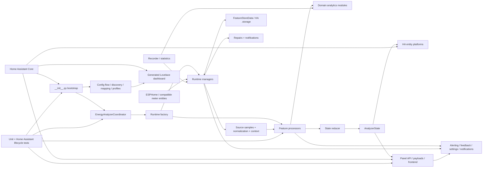

# CircuitSetup Energy Analyzer Codegraph

> **Pinned source:** `5b9cc33` (`5b9cc338b68bacd63aa36bdbd09eb475a9d8ccb5`), integration version `0.13.5`
> **Repository:** https://github.com/CircuitSetup/CircuitSetup-Energy-Analyzer
> **Primary source:** `custom_components/circuitsetup_energy_analyzer`

This document is a Codex-oriented semantic map of the project. It explains ownership, runtime flow, feature boundaries, persistence, Home Assistant surfaces, and likely change impact. Run the repository codegraph script inside a checkout when exact AST-derived import and symbol graphs are needed for that commit.

## How Codex should use this

1. Confirm the checkout commit:
   ```bash
   git rev-parse HEAD
   ```
2. Generate an exact graph:
   ```powershell
   .\.codex\scripts\update-codegraph.ps1
   ```
3. Read this file for semantic ownership and runtime flow.
4. Inspect the generated local graph for exact imports, symbols, entrypoints and cycles when a change is cross-cutting.
5. Generated graph output is local-only and should not be committed.

## Graph trust model

- **Inventory and entrypoint facts:** pinned to the current GitHub tree and key source files.
- **Semantic runtime edges:** curated, intended to explain responsibility and data flow.
- **Exact imports and definitions:** generated locally by `generate_codegraph.py`.
- **Call graph:** best effort only; Python's dynamic dispatch and Home Assistant callbacks prevent a fully static call graph.

## System map



## Core runtime flow

### Config-entry setup

1. Home Assistant loads `manifest.json`.
2. `__init__.async_setup_entry` loads `FeatureStoreData`.
3. It constructs `EnergyAnalyzerCoordinator`; `runtime_factory.initialize_runtime` attaches managers, processors and `AnalyzerState`.
4. For the first config entry, it registers shared services and the evidence panel.
5. `SourceUpdateManager` starts listeners for selected source, context and schedule entities.
6. Home Assistant forwards setup to `sensor`, `binary_sensor`, `button`, `select`, `number`, `switch`, `text`, and `time`.

### Source update

```text
Home Assistant state_changed event
  -> SourceUpdateManager (debounce and bounded batching)
  -> SourceSampleBuilder / normalize.py
  -> NormalizedCircuitSample
  -> ProcessingContextBuilder
  -> ProcessingPipeline
  -> processors/*
  -> FeatureResult
       events
       observations
       alerts
       state updates
       repairs
       notifications
  -> EnergyAnalyzerCoordinator.async_apply_feature_result
  -> StateReducer
  -> StorePersistenceManager / NotificationController / Repairs
  -> AnalyzerState
  -> Home Assistant entities and evidence panel
```

### Feedback loop

```text
Evidence panel or HA control
  -> panel*.py / services.py / button.py / select.py / number.py / switch.py / text.py / time.py
  -> coordinator facade
  -> evidence, NILM, settings, dashboard or entity-profile controller
  -> alert feedback, NILM review, recommendation decision or circuit setting
  -> FeatureStoreData
  -> future processing behavior
  -> refreshed entity/panel state
```

## Architectural layers

| Layer | File | Primary responsibility |
|---|---|---|
| `bootstrap` | `custom_components/circuitsetup_energy_analyzer/__init__.py` | Home Assistant config-entry lifecycle; constructs coordinator, loads store, registers shared services/panel, starts source listeners, forwards platforms. |
| `bootstrap` | `custom_components/circuitsetup_energy_analyzer/const.py` | Domain, platform list, config keys, defaults, storage key/version, entity-detail and dashboard-layout constants. |
| `bootstrap` | `custom_components/circuitsetup_energy_analyzer/manifest.json` | Home Assistant integration metadata, dependencies and release version. |
| `configuration` | `custom_components/circuitsetup_energy_analyzer/config_flow.py` | Initial and options flows: source discovery, circuit assignments, advanced settings, entity detail, dashboard creation and suggested settings. |
| `configuration` | `custom_components/circuitsetup_energy_analyzer/config_parsing.py` | Converts config-entry data/options and source entities into runtime circuit and mains-context configs. |
| `configuration` | `custom_components/circuitsetup_energy_analyzer/context_sources.py` | Shared missing-versus-explicit-empty-aware parsing for optional mains, weather and water context sources. |
| `configuration` | `custom_components/circuitsetup_energy_analyzer/discovery.py` | Source-device/entity discovery and grouping. |
| `configuration` | `custom_components/circuitsetup_energy_analyzer/mapping.py` | Sensor-to-circuit role mapping and mapping validation. |
| `configuration` | `custom_components/circuitsetup_energy_analyzer/profiles.py` | Appliance-profile capabilities, required/recommended roles and feature applicability. |
| `configuration` | `custom_components/circuitsetup_energy_analyzer/appliance_metadata.py` | User-facing appliance labels and metadata. |
| `configuration` | `custom_components/circuitsetup_energy_analyzer/demo.py` | Demo source bundle and sample setup support. |
| `configuration` | `custom_components/circuitsetup_energy_analyzer/localized_text.py` | Runtime access to bundled translated panel and notification text. |
| `configuration` | `custom_components/circuitsetup_energy_analyzer/ux.py` | User-facing status labels, sensitivity normalization and explanation helpers. |
| `orchestration` | `custom_components/circuitsetup_energy_analyzer/coordinator.py` | Stable Home Assistant-facing facade that delegates source updates, processing, persistence, feedback and settings to runtime managers. |
| `orchestration` | `custom_components/circuitsetup_energy_analyzer/runtime_factory.py` | Composition root for managers, ordered processors, callbacks, retained runtime caches and `AnalyzerState`. |
| `orchestration` | `custom_components/circuitsetup_energy_analyzer/state.py` | `AnalyzerState`, shared learning-state query and final event/alert reduction. |
| `orchestration` | `custom_components/circuitsetup_energy_analyzer/managers/` | Runtime ownership boundaries for source ingestion, processing, state reduction, persistence, controllers and Home Assistant side effects. |
| `domain_model` | `custom_components/circuitsetup_energy_analyzer/models.py` | Core immutable domain types: appliance profiles, circuit modes, sensor roles, configs, samples, events, baselines and alert evidence. |
| `domain_model` | `custom_components/circuitsetup_energy_analyzer/normalize.py` | Converts Home Assistant states into normalized single/dual-phase circuit samples with units, sign conventions and quality issues. |
| `domain_model` | `custom_components/circuitsetup_energy_analyzer/local_time.py` | Home Assistant-local calendar/time conversion helpers used by daily and contextual analysis. |
| `domain_model` | `custom_components/circuitsetup_energy_analyzer/baseline.py` | Robust baseline statistics and deviation scoring. |
| `domain_model` | `custom_components/circuitsetup_energy_analyzer/contextual_baseline.py` | Context fingerprints, context sample histories, fallback selection and contextual baseline building. |
| `domain_model` | `custom_components/circuitsetup_energy_analyzer/operating_detection.py` | Profile-aware thresholds, dwell/hysteresis state machine, operating snapshots and START/STOP/voltage-sag event generation. |
| `domain_model` | `custom_components/circuitsetup_energy_analyzer/events.py` | Event compatibility/helpers around detected circuit activity. |
| `domain_model` | `custom_components/circuitsetup_energy_analyzer/cycles.py` | Run-session construction, short-gap merging, runtime/duty-cycle summaries and cycle feature extraction. |
| `domain_model` | `custom_components/circuitsetup_energy_analyzer/aggregation.py` | Cross-sensor/cross-circuit aggregation helpers. |
| `domain_model` | `custom_components/circuitsetup_energy_analyzer/ids.py` | Stable readable tuple identifiers for persisted and user-action records. |
| `analytics` | `custom_components/circuitsetup_energy_analyzer/activity_alerts.py` | Activity-duration and inactivity evidence logic. |
| `analytics` | `custom_components/circuitsetup_energy_analyzer/activity_timeline.py` | Recent activity timeline assembly. |
| `analytics` | `custom_components/circuitsetup_energy_analyzer/appliance_detail.py` | Direct-meter and NILM appliance detail, comparisons, expectations, readiness, history and cost summaries. |
| `analytics` | `custom_components/circuitsetup_energy_analyzer/appliance_detail_models.py` | Typed appliance-detail, comparison, expectation and timeline payload contracts. |
| `analytics` | `custom_components/circuitsetup_energy_analyzer/appliance_insights.py` | Cross-appliance insights and bounded explanations for energy changes. |
| `analytics` | `custom_components/circuitsetup_energy_analyzer/attention.py` | Prioritized actionable appliance attention items for the panel. |
| `analytics` | `custom_components/circuitsetup_energy_analyzer/balance.py` | Mains versus monitored-load balance calculations. |
| `analytics` | `custom_components/circuitsetup_energy_analyzer/billing.py` | Billing-cycle usage and forecast calculations. |
| `analytics` | `custom_components/circuitsetup_energy_analyzer/capacity.py` | Current/capacity usage and limit evidence. |
| `analytics` | `custom_components/circuitsetup_energy_analyzer/cost.py` | Energy-cost and time-of-use calculations. |
| `analytics` | `custom_components/circuitsetup_energy_analyzer/demand.py` | Rolling and monthly demand calculations and evidence. |
| `analytics` | `custom_components/circuitsetup_energy_analyzer/energy_dashboard.py` | Home Assistant Energy Dashboard readiness checks. |
| `analytics` | `custom_components/circuitsetup_energy_analyzer/expected_schedule.py` | Appliance expected-schedule settings, active-window evaluation and missed/late/extra-use context. |
| `analytics` | `custom_components/circuitsetup_energy_analyzer/goals.py` | Daily energy-goal tracking. |
| `analytics` | `custom_components/circuitsetup_energy_analyzer/load_shift.py` | Flexible-load and solar load-shift analysis. |
| `analytics` | `custom_components/circuitsetup_energy_analyzer/metric_consistency.py` | W/VA/V/A/PF relationship checks. |
| `analytics` | `custom_components/circuitsetup_energy_analyzer/nilm.py` | Experimental mains edge detection, masking, clustering and signature logic. |
| `analytics` | `custom_components/circuitsetup_energy_analyzer/nilm_virtual.py` | Virtual-appliance state derived from reviewed NILM assignments and sessions. |
| `analytics` | `custom_components/circuitsetup_energy_analyzer/phase_balance.py` | Dual-phase leg balance calculations. |
| `analytics` | `custom_components/circuitsetup_energy_analyzer/power_quality.py` | Power-quality feature observation and baseline comparison. |
| `analytics` | `custom_components/circuitsetup_energy_analyzer/safety.py` | Safety-adjacent wording/guardrails. |
| `analytics` | `custom_components/circuitsetup_energy_analyzer/session_timeline.py` | Bounded appliance-session timeline and history helpers. |
| `analytics` | `custom_components/circuitsetup_energy_analyzer/settings_preview.py` | Recommendation-only impact previews computed from retained observations. |
| `analytics` | `custom_components/circuitsetup_energy_analyzer/solar_flow.py` | Solar generation, site load, import/export and surplus calculations. |
| `analytics` | `custom_components/circuitsetup_energy_analyzer/standby.py` | Standby/Always-On estimation and status. |
| `analytics` | `custom_components/circuitsetup_energy_analyzer/tariff.py` | Shared configured electricity-rate selection from global cost settings. |
| `analytics` | `custom_components/circuitsetup_energy_analyzer/unknown_loads.py` | NILM unknown-load inventory, review state and heuristic classification. |
| `analytics` | `custom_components/circuitsetup_energy_analyzer/usage.py` | Cumulative-energy folding and daily usage/spike analysis. |
| `analytics` | `custom_components/circuitsetup_energy_analyzer/utility_comparison.py` | Measured-versus-utility/Opower energy comparison. |
| `analytics` | `custom_components/circuitsetup_energy_analyzer/water_correlations.py` | Rain, pump and water-flow correlation/mismatch evidence. |
| `analytics` | `custom_components/circuitsetup_energy_analyzer/weather_context.py` | Outdoor-temperature-aware HVAC context and expected ranges. |
| `analytics` | `custom_components/circuitsetup_energy_analyzer/weekly_digest.py` | Completed-week appliance digest aggregation and idempotence keys. |
| `processors` | `custom_components/circuitsetup_energy_analyzer/processors/__init__.py` | See generated AST graph for symbols/imports. |
| `processors` | `custom_components/circuitsetup_energy_analyzer/processors/activity.py` | See generated AST graph for symbols/imports. |
| `processors` | `custom_components/circuitsetup_energy_analyzer/processors/base.py` | See generated AST graph for symbols/imports. |
| `processors` | `custom_components/circuitsetup_energy_analyzer/processors/billing.py` | See generated AST graph for symbols/imports. |
| `processors` | `custom_components/circuitsetup_energy_analyzer/processors/capacity.py` | See generated AST graph for symbols/imports. |
| `processors` | `custom_components/circuitsetup_energy_analyzer/processors/cost.py` | See generated AST graph for symbols/imports. |
| `processors` | `custom_components/circuitsetup_energy_analyzer/processors/cycles.py` | See generated AST graph for symbols/imports. |
| `processors` | `custom_components/circuitsetup_energy_analyzer/processors/demand.py` | See generated AST graph for symbols/imports. |
| `processors` | `custom_components/circuitsetup_energy_analyzer/processors/energy_goal.py` | See generated AST graph for symbols/imports. |
| `processors` | `custom_components/circuitsetup_energy_analyzer/processors/energy_usage.py` | See generated AST graph for symbols/imports. |
| `processors` | `custom_components/circuitsetup_energy_analyzer/processors/events.py` | See generated AST graph for symbols/imports. |
| `processors` | `custom_components/circuitsetup_energy_analyzer/processors/leg_imbalance.py` | See generated AST graph for symbols/imports. |
| `processors` | `custom_components/circuitsetup_energy_analyzer/processors/mains_balance.py` | See generated AST graph for symbols/imports. |
| `processors` | `custom_components/circuitsetup_energy_analyzer/processors/metric_consistency.py` | See generated AST graph for symbols/imports. |
| `processors` | `custom_components/circuitsetup_energy_analyzer/processors/nilm_sample.py` | See generated AST graph for symbols/imports. |
| `processors` | `custom_components/circuitsetup_energy_analyzer/processors/nilm_topology.py` | See generated AST graph for symbols/imports. |
| `processors` | `custom_components/circuitsetup_energy_analyzer/processors/power_quality.py` | See generated AST graph for symbols/imports. |
| `processors` | `custom_components/circuitsetup_energy_analyzer/processors/solar_flow.py` | See generated AST graph for symbols/imports. |
| `processors` | `custom_components/circuitsetup_energy_analyzer/processors/standby.py` | See generated AST graph for symbols/imports. |
| `processors` | `custom_components/circuitsetup_energy_analyzer/processors/utility_comparison.py` | See generated AST graph for symbols/imports. |
| `processors` | `custom_components/circuitsetup_energy_analyzer/processors/water_context.py` | See generated AST graph for symbols/imports. |
| `persistence_feedback` | `custom_components/circuitsetup_energy_analyzer/storage.py` | Home Assistant Store-backed `FeatureStoreData`, schema migrations, serialization and retention policy. |
| `persistence_feedback` | `custom_components/circuitsetup_energy_analyzer/alert_feedback.py` | Shared alert-feedback status, expiry and timestamp parsing. |
| `persistence_feedback` | `custom_components/circuitsetup_energy_analyzer/alerting.py` | Diagnostic observations, conservative repeated-evidence policy, alert fingerprints and user feedback effects. |
| `persistence_feedback` | `custom_components/circuitsetup_energy_analyzer/appliance_notifications.py` | Per-appliance notification preferences and notification eligibility. |
| `persistence_feedback` | `custom_components/circuitsetup_energy_analyzer/settings_advisor.py` | Evidence-driven advanced-setting recommendation candidates, confidence and ranking. |
| `persistence_feedback` | `custom_components/circuitsetup_energy_analyzer/recommendation_guidance.py` | Human-readable guidance for setting recommendations. |
| `persistence_feedback` | `custom_components/circuitsetup_energy_analyzer/notifications.py` | Persistent alert and settings-recommendation notification construction. |
| `persistence_feedback` | `custom_components/circuitsetup_energy_analyzer/repairs.py` | Home Assistant Repairs issue synchronization for setup/data-quality problems. |
| `persistence_feedback` | `custom_components/circuitsetup_energy_analyzer/alert_links.py` | Builds evidence-panel navigation paths. |
| `ha_surface` | `custom_components/circuitsetup_energy_analyzer/entity.py` | Shared entity base, entity tiers, device metadata and entity-profile behavior. |
| `ha_surface` | `custom_components/circuitsetup_energy_analyzer/sensor.py` | Sensor platform and summary/diagnostic entity assembly. |
| `ha_surface` | `custom_components/circuitsetup_energy_analyzer/binary_sensor.py` | Binary-sensor platform, including appliance Running and diagnostic binary states. |
| `ha_surface` | `custom_components/circuitsetup_energy_analyzer/button.py` | Per-circuit and integration-level action buttons. |
| `ha_surface` | `custom_components/circuitsetup_energy_analyzer/select.py` | Sensitivity, entity-detail and dashboard-layout select controls. |
| `ha_surface` | `custom_components/circuitsetup_energy_analyzer/number.py` | Numeric controls such as daily energy goals. |
| `ha_surface` | `custom_components/circuitsetup_energy_analyzer/switch.py` | Boolean controls for notification, expected-schedule and time-of-use settings. |
| `ha_surface` | `custom_components/circuitsetup_energy_analyzer/text.py` | Text controls for tariff and appliance-setting values. |
| `ha_surface` | `custom_components/circuitsetup_energy_analyzer/time.py` | Time controls for time-of-use boundaries. |
| `ha_surface` | `custom_components/circuitsetup_energy_analyzer/services.py` | Service registration, target resolution, validation and dispatch to coordinator operations. |
| `ha_surface` | `custom_components/circuitsetup_energy_analyzer/services.yaml` | See generated AST graph for symbols/imports. |
| `ha_surface` | `custom_components/circuitsetup_energy_analyzer/panel.py` | Panel registration, top-level payload assembly, actions and recorder-history access. |
| `ha_surface` | `custom_components/circuitsetup_energy_analyzer/panel_contracts.py` | Panel routes, API paths, custom-element names and frontend cache-buster version. |
| `ha_surface` | `custom_components/circuitsetup_energy_analyzer/panel_views.py` | Authenticated evidence, appliance, setup-health and NILM HTTP views. |
| `ha_surface` | `custom_components/circuitsetup_energy_analyzer/panel_nilm.py` | Bounded NILM workspace, assignment, overlay, session and history payloads. |
| `ha_surface` | `custom_components/circuitsetup_energy_analyzer/panel_common.py` | Shared panel payload and parsing helpers. |
| `ha_surface` | `custom_components/circuitsetup_energy_analyzer/dashboard.py` | Creates/updates a starter Lovelace dashboard using actual entity-registry IDs. |
| `ha_surface` | `custom_components/circuitsetup_energy_analyzer/diagnostics.py` | Home Assistant diagnostics payload. |
| `ha_surface` | `custom_components/circuitsetup_energy_analyzer/exporting.py` | Diagnostic/history export helpers. |
| `ha_surface` | `custom_components/circuitsetup_energy_analyzer/entities/__init__.py` | See generated AST graph for symbols/imports. |
| `ha_surface` | `custom_components/circuitsetup_energy_analyzer/entities/energy.py` | See generated AST graph for symbols/imports. |
| `ha_surface` | `custom_components/circuitsetup_energy_analyzer/entities/nilm.py` | See generated AST graph for symbols/imports. |
| `ha_surface` | `custom_components/circuitsetup_energy_analyzer/entities/settings_suggestions.py` | See generated AST graph for symbols/imports. |
| `ha_surface` | `custom_components/circuitsetup_energy_analyzer/entities/setup_health.py` | See generated AST graph for symbols/imports. |
| `ha_surface` | `custom_components/circuitsetup_energy_analyzer/entity_catalog.py` | Compact entity exposure rules, group selection and count previews shared by setup and platforms. |
| `ha_surface` | `custom_components/circuitsetup_energy_analyzer/frontend/energy-analyzer-panel.js` | Browser entry module for the modular panel shell, appliance views, evidence views, dashboard graphs and NILM workspace. |
| `ha_surface` | `custom_components/circuitsetup_energy_analyzer/translations/en.json` | See generated AST graph for symbols/imports. |

### Runtime managers

| Manager | Primary responsibility |
|---|---|
| `alert_policies.py` | Feedback-aware conservative alert policies and per-feature policy selection. |
| `circuit_registry.py` | Circuit lookup and runtime circuit relationships. |
| `config_entry_controller.py` | Config-entry option writes, reloads and entry-derived mutations. |
| `context.py` | `ProcessingContext` construction and context-source values. |
| `dashboard_controller.py` | Dashboard create/remove requests and persisted dashboard status. |
| `demo_data.py` | Deterministic demo-state and retained-history seeding. |
| `entity_profile_controller.py` | Entity-detail/profile changes and compact entity exposure. |
| `environmental_context.py` | Weather, rain, pump and water-flow histories and context refresh. |
| `evidence_actions.py` | Alert acknowledgement/feedback, maintenance and relearn actions. |
| `export_manager.py` | Diagnostics and retained-history export assembly. |
| `nilm_controller.py` | NILM runtime state, review actions, assignments and processor integration. |
| `notification_controller.py` | Learning-gated alert, settings and weekly-digest notification delivery. |
| `processing_pipeline.py` | Ordered per-circuit processor execution and feature-result application. |
| `processor_runtime.py` | Processor settings, learning maturity and cross-feature runtime helpers. |
| `recommendation_episodes.py` | Recommendation evidence episode compaction. |
| `settings_controller.py` | Advanced settings, recommendations, previews and HA setting controls. |
| `setup_health.py` | Setup-health aggregation, mapping checks and Repairs synchronization. |
| `source_samples.py` | Home Assistant source-state collection and normalized sample construction. |
| `source_updates.py` | Source listeners, deduplication, debounce and maximum-batch scheduling. |
| `state_reducer.py` | Applies `FeatureResult` state updates, observations, events and alerts. |
| `store_persistence.py` | Runtime hydration, bounded pruning and scheduled `FeatureStoreData` saves. |
| `utility_energy_sources.py` | Recorder/statistics access and energy-source aggregation. |
| `ux_state.py` | Derived readiness, health, evidence and user-facing state refresh. |

## Processor-to-feature adapters

Processors should remain thin adapters. The feature module owns calculation/evidence semantics; the processor converts one normalized sample plus `ProcessingContext` into `FeatureResult`.

| Processor | Feature module |
|---|---|
| `custom_components/circuitsetup_energy_analyzer/processors/activity.py` | `custom_components/circuitsetup_energy_analyzer/activity_alerts.py` |
| `custom_components/circuitsetup_energy_analyzer/processors/billing.py` | `custom_components/circuitsetup_energy_analyzer/billing.py` |
| `custom_components/circuitsetup_energy_analyzer/processors/capacity.py` | `custom_components/circuitsetup_energy_analyzer/capacity.py` |
| `custom_components/circuitsetup_energy_analyzer/processors/cost.py` | `custom_components/circuitsetup_energy_analyzer/cost.py` |
| `custom_components/circuitsetup_energy_analyzer/processors/cycles.py` | `custom_components/circuitsetup_energy_analyzer/cycles.py` |
| `custom_components/circuitsetup_energy_analyzer/processors/demand.py` | `custom_components/circuitsetup_energy_analyzer/demand.py` |
| `custom_components/circuitsetup_energy_analyzer/processors/energy_goal.py` | `custom_components/circuitsetup_energy_analyzer/goals.py` |
| `custom_components/circuitsetup_energy_analyzer/processors/energy_usage.py` | `custom_components/circuitsetup_energy_analyzer/usage.py` |
| `custom_components/circuitsetup_energy_analyzer/processors/events.py` | `custom_components/circuitsetup_energy_analyzer/operating_detection.py` |
| `custom_components/circuitsetup_energy_analyzer/processors/leg_imbalance.py` | `custom_components/circuitsetup_energy_analyzer/phase_balance.py` |
| `custom_components/circuitsetup_energy_analyzer/processors/mains_balance.py` | `custom_components/circuitsetup_energy_analyzer/balance.py` |
| `custom_components/circuitsetup_energy_analyzer/processors/metric_consistency.py` | `custom_components/circuitsetup_energy_analyzer/metric_consistency.py` |
| `custom_components/circuitsetup_energy_analyzer/processors/nilm_sample.py` | `custom_components/circuitsetup_energy_analyzer/nilm.py` |
| `custom_components/circuitsetup_energy_analyzer/processors/nilm_topology.py` | `custom_components/circuitsetup_energy_analyzer/nilm.py` |
| `custom_components/circuitsetup_energy_analyzer/processors/power_quality.py` | `custom_components/circuitsetup_energy_analyzer/power_quality.py` |
| `custom_components/circuitsetup_energy_analyzer/processors/solar_flow.py` | `custom_components/circuitsetup_energy_analyzer/solar_flow.py` |
| `custom_components/circuitsetup_energy_analyzer/processors/standby.py` | `custom_components/circuitsetup_energy_analyzer/standby.py` |
| `custom_components/circuitsetup_energy_analyzer/processors/utility_comparison.py` | `custom_components/circuitsetup_energy_analyzer/utility_comparison.py` |
| `custom_components/circuitsetup_energy_analyzer/processors/water_context.py` | `custom_components/circuitsetup_energy_analyzer/water_correlations.py` |

## Critical contracts

### `models.py`

Owns the stable domain vocabulary:

- `ApplianceProfile`
- `CircuitMode`
- `PowerFlowMode`
- `SensorRole`
- `CircuitConfig`
- source sample/event/baseline models
- `AlertEvidence`

Changing these types has wide impact across config flow, normalization, processors, storage, entities and tests.

### `normalize.py`

Boundary between Home Assistant source states and analytics. It must enforce:

- unit normalization;
- stale/unavailable/non-finite handling;
- load/generation/net sign semantics;
- dual-phase completeness;
- quality issue capture.

No processor should reinterpret raw Home Assistant states independently.

### `processors/base.py`

Shared processor contract:

- `ProcessingContext`
- `FeatureResult`
- `StateUpdate`

All feature processors should return results rather than causing scattered Home Assistant side effects.

### `runtime_factory.py` and `managers/`

`runtime_factory.initialize_runtime` is the composition root. `EnergyAnalyzerCoordinator` remains the public facade, while managers own distinct runtime behavior:

- source batching and sample construction;
- processing context and processor order;
- state reduction and derived UX state;
- persisted-store pruning and saves;
- settings, evidence, NILM, dashboard, export and notification actions.

Add a manager only for a durable ownership boundary. Route shared Home Assistant operations through the coordinator facade instead of importing managers across features.

### `state.py` and `managers/state_reducer.py`

`AnalyzerState` is the entity/panel-facing runtime snapshot. `StateReducer` is the authoritative `FeatureResult` application path for:

- `StateUpdate` assignment and clear semantics;
- observation history;
- event and alert state;
- feature-specific clear operations.

Processors and controllers should not create parallel state-reduction paths.

### `operating_detection.py`

Authoritative appliance operating-state subsystem:

- profile defaults and overrides;
- dwell/hysteresis;
- `OperatingStateMachine`;
- snapshots;
- START/STOP/voltage-sag events.

Running entities and cycle logic should not maintain a second threshold system.

### `alerting.py`

Owns the distinction between:

- one diagnostic observation;
- repeated evidence;
- a user-facing alert;
- feedback fingerprints/effects.

Only qualified alert evidence should reach notification policy. Routine notifications and suggested settings also require current per-circuit learning maturity in their owning controllers.

### `storage.py` and `managers/store_persistence.py`

`storage.py` owns persisted semantics, serialization and migrations. `StorePersistenceManager` owns runtime hydration, pruning and save scheduling. Any new persisted field or changed meaning requires:

- schema review;
- bounded retention;
- serialization/deserialization;
- migration;
- old-version tests.

## Home Assistant surfaces

| Surface | Files |
|---|---|
| Config and options flows | `config_flow.py`, `config_parsing.py`, `context_sources.py`, `discovery.py`, `mapping.py`, `profiles.py`, `demo.py` |
| Sensors | `sensor.py`, `entities/*`, `entity_catalog.py` |
| Binary sensors | `binary_sensor.py` |
| Buttons | `button.py` |
| Selects | `select.py` |
| Numbers | `number.py` |
| Switches | `switch.py` |
| Text controls | `text.py` |
| Time controls | `time.py` |
| Services | `services.py`, `services.yaml` |
| Evidence API/panel | `panel.py`, `panel_common.py`, `panel_contracts.py`, `panel_views.py`, `panel_nilm.py`, `frontend/energy-analyzer-*.js` |
| Starter dashboard | `dashboard.py` |
| Repairs | `repairs.py` |
| Notifications | `notifications.py`, `appliance_notifications.py`, `alert_links.py`, `managers/notification_controller.py` |
| Diagnostics/exports | `diagnostics.py`, `exporting.py` |

## Cross-circuit features

The following features may require multiple circuit or site-level inputs and therefore should not be treated as isolated per-circuit calculations:

- mains versus monitored-load balance;
- dual-phase leg balance;
- solar import/export/site load/surplus;
- flexible-load shift analysis;
- utility/Opower comparison;
- experimental mains NILM;
- known-load masking and unknown-load inventory;
- rain/pump/water-flow context.

Changes to these features should inspect coordinator ordering, source selection and Setup Health ambiguity handling.

## Change-impact guide

### Add or modify a circuit-analysis feature

**Inspect first**

  - `custom_components/circuitsetup_energy_analyzer/models.py`
  - `custom_components/circuitsetup_energy_analyzer/profiles.py`
  - `custom_components/circuitsetup_energy_analyzer/processors/base.py`
  - `custom_components/circuitsetup_energy_analyzer/runtime_factory.py`
  - `custom_components/circuitsetup_energy_analyzer/managers/processing_pipeline.py`

**Usually touched**

  - `custom_components/circuitsetup_energy_analyzer/<feature>.py`
  - `custom_components/circuitsetup_energy_analyzer/processors/<feature>.py`
  - `custom_components/circuitsetup_energy_analyzer/managers/state_reducer.py`
  - `custom_components/circuitsetup_energy_analyzer/sensor.py`
  - `custom_components/circuitsetup_energy_analyzer/translations/en.json`
  - `tests/test_processors.py`
### Change operating/running/cycle behavior

**Inspect first**

  - `custom_components/circuitsetup_energy_analyzer/operating_detection.py`
  - `custom_components/circuitsetup_energy_analyzer/processors/events.py`
  - `custom_components/circuitsetup_energy_analyzer/cycles.py`
  - `custom_components/circuitsetup_energy_analyzer/processors/cycles.py`
  - `custom_components/circuitsetup_energy_analyzer/binary_sensor.py`

**Usually touched**

  - `custom_components/circuitsetup_energy_analyzer/config_flow.py`
  - `custom_components/circuitsetup_energy_analyzer/managers/processor_runtime.py`
  - `custom_components/circuitsetup_energy_analyzer/managers/settings_controller.py`
  - `custom_components/circuitsetup_energy_analyzer/storage.py`
  - `tests/test_operating_detection.py`
  - `tests/test_cycles.py`
### Change alerts or user feedback

**Inspect first**

  - `custom_components/circuitsetup_energy_analyzer/alerting.py`
  - `custom_components/circuitsetup_energy_analyzer/alert_feedback.py`
  - `custom_components/circuitsetup_energy_analyzer/managers/evidence_actions.py`
  - `custom_components/circuitsetup_energy_analyzer/managers/notification_controller.py`
  - `custom_components/circuitsetup_energy_analyzer/storage.py`
  - `custom_components/circuitsetup_energy_analyzer/panel.py`
  - `custom_components/circuitsetup_energy_analyzer/frontend/energy-analyzer-evidence-views.js`

**Usually touched**

  - `custom_components/circuitsetup_energy_analyzer/notifications.py`
  - `custom_components/circuitsetup_energy_analyzer/appliance_notifications.py`
  - `custom_components/circuitsetup_energy_analyzer/services.py`
  - `tests/test_alerting.py`
  - `tests/test_panel.py`
  - `tests/test_services.py`
### Add persisted data or change its meaning

**Inspect first**

  - `custom_components/circuitsetup_energy_analyzer/storage.py`
  - `custom_components/circuitsetup_energy_analyzer/managers/store_persistence.py`
  - `custom_components/circuitsetup_energy_analyzer/const.py`
  - `custom_components/circuitsetup_energy_analyzer/models.py`

**Usually touched**

  - `custom_components/circuitsetup_energy_analyzer/runtime_factory.py`
  - `tests/test_storage.py`
  - `tests/fixtures/`

> **Warning:** Add an explicit migration and old-version fixture; do not rely only on tolerant .get() reads.
### Change Home Assistant entities or reduce entity count

**Inspect first**

  - `custom_components/circuitsetup_energy_analyzer/entity.py`
  - `custom_components/circuitsetup_energy_analyzer/entity_catalog.py`
  - `custom_components/circuitsetup_energy_analyzer/sensor.py`
  - `custom_components/circuitsetup_energy_analyzer/binary_sensor.py`
  - `custom_components/circuitsetup_energy_analyzer/button.py`
  - `custom_components/circuitsetup_energy_analyzer/select.py`
  - `custom_components/circuitsetup_energy_analyzer/number.py`
  - `custom_components/circuitsetup_energy_analyzer/switch.py`
  - `custom_components/circuitsetup_energy_analyzer/text.py`
  - `custom_components/circuitsetup_energy_analyzer/time.py`
  - `custom_components/circuitsetup_energy_analyzer/entities/`
  - `custom_components/circuitsetup_energy_analyzer/config_flow.py`

**Usually touched**

  - `custom_components/circuitsetup_energy_analyzer/dashboard.py`
  - `custom_components/circuitsetup_energy_analyzer/translations/en.json`
  - `tests/test_entities.py`
  - `tests/test_profiles.py`

> **Warning:** Preserve unique IDs and migration behavior for existing dashboards/automations.
### Change setup/source mapping

**Inspect first**

  - `custom_components/circuitsetup_energy_analyzer/config_flow.py`
  - `custom_components/circuitsetup_energy_analyzer/config_parsing.py`
  - `custom_components/circuitsetup_energy_analyzer/context_sources.py`
  - `custom_components/circuitsetup_energy_analyzer/discovery.py`
  - `custom_components/circuitsetup_energy_analyzer/mapping.py`
  - `custom_components/circuitsetup_energy_analyzer/profiles.py`
  - `custom_components/circuitsetup_energy_analyzer/normalize.py`

**Usually touched**

  - `custom_components/circuitsetup_energy_analyzer/__init__.py`
  - `custom_components/circuitsetup_energy_analyzer/managers/source_samples.py`
  - `custom_components/circuitsetup_energy_analyzer/managers/source_updates.py`
  - `custom_components/circuitsetup_energy_analyzer/managers/setup_health.py`
  - `custom_components/circuitsetup_energy_analyzer/repairs.py`
  - `custom_components/circuitsetup_energy_analyzer/entities/setup_health.py`
  - `tests/test_config_flow.py`
  - `tests_homeassistant/`
### Change evidence panel or UI actions

**Inspect first**

  - `custom_components/circuitsetup_energy_analyzer/panel.py`
  - `custom_components/circuitsetup_energy_analyzer/panel_contracts.py`
  - `custom_components/circuitsetup_energy_analyzer/panel_views.py`
  - `custom_components/circuitsetup_energy_analyzer/panel_nilm.py`
  - `custom_components/circuitsetup_energy_analyzer/frontend/energy-analyzer-*.js`
  - `custom_components/circuitsetup_energy_analyzer/services.py`

**Usually touched**

  - `custom_components/circuitsetup_energy_analyzer/managers/evidence_actions.py`
  - `custom_components/circuitsetup_energy_analyzer/managers/settings_controller.py`
  - `custom_components/circuitsetup_energy_analyzer/alerting.py`
  - `custom_components/circuitsetup_energy_analyzer/settings_advisor.py`
  - `tests/test_panel.py`

> **Warning:** Bump `panel_contracts.py::PANEL_MODULE_VERSION` whenever shipped frontend JavaScript changes.

## High-risk modules

1. `runtime_factory.py` + `managers/processing_pipeline.py`
   - manager/processor composition and callback wiring;
   - feature order and cross-circuit processing;
   - state, persistence and side-effect boundaries.

2. `coordinator.py`
   - broad public facade used by platforms, services, panel and tests;
   - source-update and configuration lifecycle.

3. `config_flow.py` + `managers/settings_controller.py`
   - setup and options compatibility;
   - source expansion;
   - advanced-setting round trips;
   - recommendation generation, previews and decisions;
   - user-facing validation.

4. `storage.py` + `managers/store_persistence.py`
   - backwards compatibility and bounded growth.

5. `sensor.py` + `entity_catalog.py`
   - large Home Assistant entity surface, stable identities and recorder impact.

6. `alerting.py` + `managers/notification_controller.py`
   - user trust, alert qualification, learning gates and feedback matching.

7. `operating_detection.py`
   - Running automations, cycle counts and baseline evidence.

8. `panel.py` + `panel_views.py` + `panel_nilm.py` + frontend JavaScript
   - authenticated actions, bounded history, internal-ID resolution and backend/frontend contracts.

## Repository/test map

| Area | Purpose |
|---|---|
| `tests/` | Fast unit, processor, service, entity, storage, calibration and UX tests |
| `tests_homeassistant/` | Real Home Assistant runtime/lifecycle contract tests |
| `.github/` | CI workflows |
| `.codex/scripts/` | Codex/automation support |
| `docs/` | User/developer/QA documentation and example dashboard |
| `blueprints/` | Home Assistant alert automation blueprint |
| `scripts/` | Project utilities |
| `AGENTS.md` | Repository-specific agent instructions |

## JSON queries

Find inbound dependencies after running the AST generator:

```bash
python - <<'PY'
import json
from pathlib import Path

g = json.loads(Path("docs/codegraph/generated/codegraph.generated.json").read_text())
target = "custom_components.circuitsetup_energy_analyzer.alerting"
for e in g["edges"]:
    if e["relation"] == "imports" and e["target"] == target:
        print(e["source"])
PY
```

## Maintenance rule

Regenerate this graph after:

- adding, removing or moving a module;
- adding a platform;
- changing config-entry entrypoints;
- changing processor registration;
- changing runtime-manager ownership or composition;
- moving feature logic between processor and domain module;
- changing `FeatureResult` or `AnalyzerState` reduction;
- changing entity-catalog exposure rules or platforms;
- adding a panel API endpoint;
- changing panel contracts or frontend entry modules;
- changing storage ownership;
- changing the coordinator pipeline.
