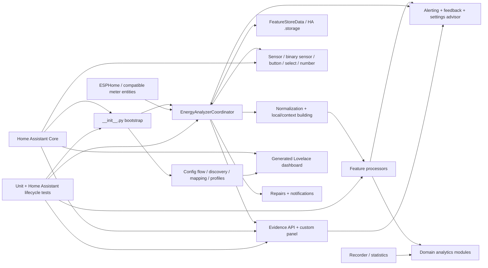

# CircuitSetup Energy Analyzer Codegraph

> **Pinned source:** `f0dee7a` (`f0dee7a5a2104dcad4d099b97b9f3f2cc3d44780`), integration version `0.9.1`  
> **Repository:** https://github.com/CircuitSetup/CircuitSetup-Energy-Analyzer  
> **Primary source:** `custom_components/circuitsetup_energy_analyzer`

This document is a Codex-oriented semantic map of the project. It explains ownership, runtime flow, feature boundaries, persistence, Home Assistant surfaces, and likely change impact.

The bundled `codegraph.json` contains the same graph in machine-readable form. The bundled `generate_codegraph.py` should be run inside a checkout to produce exact AST-derived import and symbol graphs for the checked-out commit.

## How Codex should use this

1. Confirm the checkout commit:
   ```bash
   git rev-parse HEAD
   ```
2. Generate an exact graph:
   ```bash
   python generate_codegraph.py . --output-dir docs/codegraph/generated
   ```
3. Read this file for semantic ownership and runtime flow.
4. Read `docs/codegraph/generated/CODEGRAPH.generated.md` for exact imports, symbols, entrypoints and cycles.
5. Query the JSON graph before changing cross-cutting code.
6. Update/regenerate the graph in the same PR whenever modules, imports, entrypoints, processor registration or platform surfaces change.

## Graph trust model

- **Inventory and entrypoint facts:** pinned to the current GitHub tree and key source files.
- **Semantic runtime edges:** curated, intended to explain responsibility and data flow.
- **Exact imports and definitions:** generated locally by `generate_codegraph.py`.
- **Call graph:** best effort only; Python's dynamic dispatch and Home Assistant callbacks prevent a fully static call graph.

## System map



## Core runtime flow

### Config-entry setup

1. Home Assistant loads `manifest.json`.
2. `__init__.async_setup_entry` loads `FeatureStoreData`.
3. It constructs `EnergyAnalyzerCoordinator`.
4. For the first config entry, it registers shared services and the evidence panel.
5. The coordinator starts listeners for all selected source entities.
6. Home Assistant forwards setup to `sensor`, `binary_sensor`, `button`, `select`, and `number`.

### Source update

```text
Home Assistant state_changed event
  -> EnergyAnalyzerCoordinator
  -> normalize.py
  -> NormalizedCircuitSample
  -> local_time/contextual_baseline context
  -> processors/*
  -> FeatureResult
       events
       observations
       alerts
       state updates
       repairs
       notifications
  -> coordinator applies results
  -> storage / notifications / Repairs
  -> Home Assistant entities and evidence panel
```

### Feedback loop

```text
Evidence panel or HA control
  -> panel.py / services.py / button.py / select.py / number.py
  -> coordinator operation
  -> alert feedback, NILM review, recommendation decision or circuit setting
  -> FeatureStoreData
  -> future processing behavior
  -> refreshed entity/panel state
```

## Architectural layers

| Layer | File | Primary responsibility |
|---|---|---|
| `bootstrap` | `custom_components/circuitsetup_energy_analyzer/__init__.py` | Home Assistant config-entry lifecycle; constructs coordinator, loads store, registers shared services/panel, starts source listeners, forwards platforms. |
| `bootstrap` | `custom_components/circuitsetup_energy_analyzer/const.py` | Domain, platform list, config keys, defaults, storage key/version, entity-detail and dashboard-layout constants. |
| `bootstrap` | `custom_components/circuitsetup_energy_analyzer/manifest.json` | See generated AST graph for symbols/imports. |
| `configuration` | `custom_components/circuitsetup_energy_analyzer/config_flow.py` | Initial and options flows: source discovery, circuit assignments, advanced settings, entity detail, dashboard creation and suggested settings. |
| `configuration` | `custom_components/circuitsetup_energy_analyzer/discovery.py` | Source-device/entity discovery and grouping. |
| `configuration` | `custom_components/circuitsetup_energy_analyzer/mapping.py` | Sensor-to-circuit role mapping and mapping validation. |
| `configuration` | `custom_components/circuitsetup_energy_analyzer/profiles.py` | Appliance-profile capabilities, required/recommended roles and feature applicability. |
| `configuration` | `custom_components/circuitsetup_energy_analyzer/appliance_metadata.py` | User-facing appliance labels and metadata. |
| `configuration` | `custom_components/circuitsetup_energy_analyzer/demo.py` | Demo source bundle and sample setup support. |
| `configuration` | `custom_components/circuitsetup_energy_analyzer/ux.py` | User-facing status labels, sensitivity normalization and explanation helpers. |
| `orchestration` | `custom_components/circuitsetup_energy_analyzer/coordinator.py` | Central runtime orchestration and AnalyzerState; receives source changes, builds context, runs processors, applies results, manages persistence and feedback. |
| `orchestration` | `custom_components/circuitsetup_energy_analyzer/processors/base.py` | See generated AST graph for symbols/imports. |
| `domain_model` | `custom_components/circuitsetup_energy_analyzer/models.py` | Core immutable domain types: appliance profiles, circuit modes, sensor roles, configs, samples, events, baselines and alert evidence. |
| `domain_model` | `custom_components/circuitsetup_energy_analyzer/normalize.py` | Converts Home Assistant states into normalized single/dual-phase circuit samples with units, sign conventions and quality issues. |
| `domain_model` | `custom_components/circuitsetup_energy_analyzer/local_time.py` | Home Assistant-local calendar/time conversion helpers used by daily and contextual analysis. |
| `domain_model` | `custom_components/circuitsetup_energy_analyzer/baseline.py` | Robust baseline statistics and deviation scoring. |
| `domain_model` | `custom_components/circuitsetup_energy_analyzer/contextual_baseline.py` | Context fingerprints, context sample histories, fallback selection and contextual baseline building. |
| `domain_model` | `custom_components/circuitsetup_energy_analyzer/operating_detection.py` | Profile-aware thresholds, dwell/hysteresis state machine, operating snapshots and START/STOP/voltage-sag event generation. |
| `domain_model` | `custom_components/circuitsetup_energy_analyzer/events.py` | Event compatibility/helpers around detected circuit activity. |
| `domain_model` | `custom_components/circuitsetup_energy_analyzer/cycles.py` | Run-session construction, short-gap merging, runtime/duty-cycle summaries and cycle feature extraction. |
| `domain_model` | `custom_components/circuitsetup_energy_analyzer/aggregation.py` | Cross-sensor/cross-circuit aggregation helpers. |
| `analytics` | `custom_components/circuitsetup_energy_analyzer/activity_alerts.py` | Activity-duration and inactivity evidence logic. |
| `analytics` | `custom_components/circuitsetup_energy_analyzer/activity_timeline.py` | Recent activity timeline assembly. |
| `analytics` | `custom_components/circuitsetup_energy_analyzer/balance.py` | Mains versus monitored-load balance calculations. |
| `analytics` | `custom_components/circuitsetup_energy_analyzer/billing.py` | Billing-cycle usage and forecast calculations. |
| `analytics` | `custom_components/circuitsetup_energy_analyzer/capacity.py` | Current/capacity usage and limit evidence. |
| `analytics` | `custom_components/circuitsetup_energy_analyzer/cost.py` | Energy-cost and time-of-use calculations. |
| `analytics` | `custom_components/circuitsetup_energy_analyzer/demand.py` | Rolling and monthly demand calculations and evidence. |
| `analytics` | `custom_components/circuitsetup_energy_analyzer/energy_dashboard.py` | Home Assistant Energy Dashboard readiness checks. |
| `analytics` | `custom_components/circuitsetup_energy_analyzer/goals.py` | Daily energy-goal tracking. |
| `analytics` | `custom_components/circuitsetup_energy_analyzer/load_shift.py` | Flexible-load and solar load-shift analysis. |
| `analytics` | `custom_components/circuitsetup_energy_analyzer/metric_consistency.py` | W/VA/V/A/PF relationship checks. |
| `analytics` | `custom_components/circuitsetup_energy_analyzer/nilm.py` | Experimental mains edge detection, masking, clustering and signature logic. |
| `analytics` | `custom_components/circuitsetup_energy_analyzer/phase_balance.py` | Dual-phase leg balance calculations. |
| `analytics` | `custom_components/circuitsetup_energy_analyzer/power_quality.py` | Power-quality feature observation and baseline comparison. |
| `analytics` | `custom_components/circuitsetup_energy_analyzer/safety.py` | Safety-adjacent wording/guardrails. |
| `analytics` | `custom_components/circuitsetup_energy_analyzer/solar_flow.py` | Solar generation, site load, import/export and surplus calculations. |
| `analytics` | `custom_components/circuitsetup_energy_analyzer/standby.py` | Standby/Always-On estimation and status. |
| `analytics` | `custom_components/circuitsetup_energy_analyzer/unknown_loads.py` | NILM unknown-load inventory, review state and heuristic classification. |
| `analytics` | `custom_components/circuitsetup_energy_analyzer/usage.py` | Cumulative-energy folding and daily usage/spike analysis. |
| `analytics` | `custom_components/circuitsetup_energy_analyzer/utility_comparison.py` | Measured-versus-utility/Opower energy comparison. |
| `analytics` | `custom_components/circuitsetup_energy_analyzer/water_correlations.py` | Rain, pump and water-flow correlation/mismatch evidence. |
| `analytics` | `custom_components/circuitsetup_energy_analyzer/weather_context.py` | Outdoor-temperature-aware HVAC context and expected ranges. |
| `processors` | `custom_components/circuitsetup_energy_analyzer/processors/__init__.py` | See generated AST graph for symbols/imports. |
| `processors` | `custom_components/circuitsetup_energy_analyzer/processors/activity.py` | See generated AST graph for symbols/imports. |
| `processors` | `custom_components/circuitsetup_energy_analyzer/processors/base.py` | See generated AST graph for symbols/imports. |
| `processors` | `custom_components/circuitsetup_energy_analyzer/processors/billing.py` | See generated AST graph for symbols/imports. |
| `processors` | `custom_components/circuitsetup_energy_analyzer/processors/capacity.py` | See generated AST graph for symbols/imports. |
| `processors` | `custom_components/circuitsetup_energy_analyzer/processors/cost.py` | See generated AST graph for symbols/imports. |
| `processors` | `custom_components/circuitsetup_energy_analyzer/processors/cycles.py` | See generated AST graph for symbols/imports. |
| `processors` | `custom_components/circuitsetup_energy_analyzer/processors/demand.py` | See generated AST graph for symbols/imports. |
| `processors` | `custom_components/circuitsetup_energy_analyzer/processors/energy_goal.py` | See generated AST graph for symbols/imports. |
| `processors` | `custom_components/circuitsetup_energy_analyzer/processors/energy_usage.py` | See generated AST graph for symbols/imports. |
| `processors` | `custom_components/circuitsetup_energy_analyzer/processors/events.py` | See generated AST graph for symbols/imports. |
| `processors` | `custom_components/circuitsetup_energy_analyzer/processors/leg_imbalance.py` | See generated AST graph for symbols/imports. |
| `processors` | `custom_components/circuitsetup_energy_analyzer/processors/mains_balance.py` | See generated AST graph for symbols/imports. |
| `processors` | `custom_components/circuitsetup_energy_analyzer/processors/metric_consistency.py` | See generated AST graph for symbols/imports. |
| `processors` | `custom_components/circuitsetup_energy_analyzer/processors/nilm_sample.py` | See generated AST graph for symbols/imports. |
| `processors` | `custom_components/circuitsetup_energy_analyzer/processors/nilm_topology.py` | See generated AST graph for symbols/imports. |
| `processors` | `custom_components/circuitsetup_energy_analyzer/processors/power_quality.py` | See generated AST graph for symbols/imports. |
| `processors` | `custom_components/circuitsetup_energy_analyzer/processors/solar_flow.py` | See generated AST graph for symbols/imports. |
| `processors` | `custom_components/circuitsetup_energy_analyzer/processors/standby.py` | See generated AST graph for symbols/imports. |
| `processors` | `custom_components/circuitsetup_energy_analyzer/processors/utility_comparison.py` | See generated AST graph for symbols/imports. |
| `processors` | `custom_components/circuitsetup_energy_analyzer/processors/water_context.py` | See generated AST graph for symbols/imports. |
| `persistence_feedback` | `custom_components/circuitsetup_energy_analyzer/storage.py` | Home Assistant Store-backed FeatureStoreData, migrations, serialization, pruning and retention caps. |
| `persistence_feedback` | `custom_components/circuitsetup_energy_analyzer/alerting.py` | Diagnostic observations, conservative repeated-evidence policy, alert fingerprints and user feedback effects. |
| `persistence_feedback` | `custom_components/circuitsetup_energy_analyzer/settings_advisor.py` | Evidence-driven advanced-setting recommendations and apply/deny/dismiss decision handling. |
| `persistence_feedback` | `custom_components/circuitsetup_energy_analyzer/recommendation_guidance.py` | Human-readable guidance for setting recommendations. |
| `persistence_feedback` | `custom_components/circuitsetup_energy_analyzer/notifications.py` | Persistent alert and settings-recommendation notification construction. |
| `persistence_feedback` | `custom_components/circuitsetup_energy_analyzer/repairs.py` | Home Assistant Repairs issue synchronization for setup/data-quality problems. |
| `persistence_feedback` | `custom_components/circuitsetup_energy_analyzer/alert_links.py` | Builds evidence-panel navigation paths. |
| `ha_surface` | `custom_components/circuitsetup_energy_analyzer/entity.py` | Shared entity base, entity tiers, device metadata and entity-profile behavior. |
| `ha_surface` | `custom_components/circuitsetup_energy_analyzer/sensor.py` | Sensor platform and summary/diagnostic entity assembly. |
| `ha_surface` | `custom_components/circuitsetup_energy_analyzer/binary_sensor.py` | Binary-sensor platform, including appliance Running and diagnostic binary states. |
| `ha_surface` | `custom_components/circuitsetup_energy_analyzer/button.py` | Per-circuit and integration-level action buttons. |
| `ha_surface` | `custom_components/circuitsetup_energy_analyzer/select.py` | Sensitivity, entity-detail and dashboard-layout select controls. |
| `ha_surface` | `custom_components/circuitsetup_energy_analyzer/number.py` | Numeric controls such as daily energy goals. |
| `ha_surface` | `custom_components/circuitsetup_energy_analyzer/services.py` | Service registration, target resolution, validation and dispatch to coordinator operations. |
| `ha_surface` | `custom_components/circuitsetup_energy_analyzer/services.yaml` | See generated AST graph for symbols/imports. |
| `ha_surface` | `custom_components/circuitsetup_energy_analyzer/panel.py` | Authenticated evidence API and custom panel registration/action endpoints. |
| `ha_surface` | `custom_components/circuitsetup_energy_analyzer/dashboard.py` | Creates/updates a starter Lovelace dashboard using actual entity-registry IDs. |
| `ha_surface` | `custom_components/circuitsetup_energy_analyzer/diagnostics.py` | Home Assistant diagnostics payload. |
| `ha_surface` | `custom_components/circuitsetup_energy_analyzer/exporting.py` | Diagnostic/history export helpers. |
| `ha_surface` | `custom_components/circuitsetup_energy_analyzer/entities/__init__.py` | See generated AST graph for symbols/imports. |
| `ha_surface` | `custom_components/circuitsetup_energy_analyzer/entities/energy.py` | See generated AST graph for symbols/imports. |
| `ha_surface` | `custom_components/circuitsetup_energy_analyzer/entities/nilm.py` | See generated AST graph for symbols/imports. |
| `ha_surface` | `custom_components/circuitsetup_energy_analyzer/entities/settings_suggestions.py` | See generated AST graph for symbols/imports. |
| `ha_surface` | `custom_components/circuitsetup_energy_analyzer/entities/setup_health.py` | See generated AST graph for symbols/imports. |
| `ha_surface` | `custom_components/circuitsetup_energy_analyzer/frontend/energy-analyzer-panel.js` | Browser-side evidence, NILM review and suggested-setting action interface. |
| `ha_surface` | `custom_components/circuitsetup_energy_analyzer/strings.json` | See generated AST graph for symbols/imports. |
| `ha_surface` | `custom_components/circuitsetup_energy_analyzer/translations/en.json` | See generated AST graph for symbols/imports. |

## Processor-to-feature adapters

Processors should remain thin adapters. The feature module owns calculation/evidence semantics; the processor converts one normalized sample plus `ProcessingContext` into `FeatureResult`.

| Processor | Feature module |
|---|---|
| `custom_components/circuitsetup_energy_analyzer/processors/activity.py` | `custom_components/circuitsetup_energy_analyzer/activity_alerts.py` |
| `custom_components/circuitsetup_energy_analyzer/processors/billing.py` | `custom_components/circuitsetup_energy_analyzer/billing.py` |
| `custom_components/circuitsetup_energy_analyzer/processors/capacity.py` | `custom_components/circuitsetup_energy_analyzer/capacity.py` |
| `custom_components/circuitsetup_energy_analyzer/processors/cost.py` | `custom_components/circuitsetup_energy_analyzer/cost.py` |
| `custom_components/circuitsetup_energy_analyzer/processors/cycles.py` | `custom_components/circuitsetup_energy_analyzer/cycles.py` |
| `custom_components/circuitsetup_energy_analyzer/processors/demand.py` | `custom_components/circuitsetup_energy_analyzer/demand.py` |
| `custom_components/circuitsetup_energy_analyzer/processors/energy_goal.py` | `custom_components/circuitsetup_energy_analyzer/goals.py` |
| `custom_components/circuitsetup_energy_analyzer/processors/energy_usage.py` | `custom_components/circuitsetup_energy_analyzer/usage.py` |
| `custom_components/circuitsetup_energy_analyzer/processors/events.py` | `custom_components/circuitsetup_energy_analyzer/operating_detection.py` |
| `custom_components/circuitsetup_energy_analyzer/processors/leg_imbalance.py` | `custom_components/circuitsetup_energy_analyzer/phase_balance.py` |
| `custom_components/circuitsetup_energy_analyzer/processors/mains_balance.py` | `custom_components/circuitsetup_energy_analyzer/balance.py` |
| `custom_components/circuitsetup_energy_analyzer/processors/metric_consistency.py` | `custom_components/circuitsetup_energy_analyzer/metric_consistency.py` |
| `custom_components/circuitsetup_energy_analyzer/processors/nilm_sample.py` | `custom_components/circuitsetup_energy_analyzer/nilm.py` |
| `custom_components/circuitsetup_energy_analyzer/processors/nilm_topology.py` | `custom_components/circuitsetup_energy_analyzer/nilm.py` |
| `custom_components/circuitsetup_energy_analyzer/processors/power_quality.py` | `custom_components/circuitsetup_energy_analyzer/power_quality.py` |
| `custom_components/circuitsetup_energy_analyzer/processors/solar_flow.py` | `custom_components/circuitsetup_energy_analyzer/solar_flow.py` |
| `custom_components/circuitsetup_energy_analyzer/processors/standby.py` | `custom_components/circuitsetup_energy_analyzer/standby.py` |
| `custom_components/circuitsetup_energy_analyzer/processors/utility_comparison.py` | `custom_components/circuitsetup_energy_analyzer/utility_comparison.py` |
| `custom_components/circuitsetup_energy_analyzer/processors/water_context.py` | `custom_components/circuitsetup_energy_analyzer/water_correlations.py` |

## Critical contracts

### `models.py`

Owns the stable domain vocabulary:

- `ApplianceProfile`
- `CircuitMode`
- `PowerFlowMode`
- `SensorRole`
- `CircuitConfig`
- source sample/event/baseline models
- `AlertEvidence`

Changing these types has wide impact across config flow, normalization, processors, storage, entities and tests.

### `normalize.py`

Boundary between Home Assistant source states and analytics. It must enforce:

- unit normalization;
- stale/unavailable/non-finite handling;
- load/generation/net sign semantics;
- dual-phase completeness;
- quality issue capture.

No processor should reinterpret raw Home Assistant states independently.

### `processors/base.py`

Shared processor contract:

- `ProcessingContext`
- `FeatureResult`
- `StateUpdate`
- `FeatureProcessor`

All feature processors should return results rather than causing scattered Home Assistant side effects.

### `operating_detection.py`

Authoritative appliance operating-state subsystem:

- profile defaults and overrides;
- dwell/hysteresis;
- `OperatingStateMachine`;
- snapshots;
- START/STOP/voltage-sag events.

Running entities and cycle logic should not maintain a second threshold system.

### `alerting.py`

Owns the distinction between:

- one diagnostic observation;
- repeated evidence;
- a user-facing alert;
- feedback fingerprints/effects.

Only qualified alert evidence should create notifications.

### `storage.py`

Owns persisted semantics and migrations. Any new persisted field or changed meaning requires:

- schema review;
- bounded retention;
- serialization/deserialization;
- migration;
- old-version tests.

## Home Assistant surfaces

| Surface | Files |
|---|---|
| Config and options flows | `config_flow.py`, `discovery.py`, `mapping.py`, `profiles.py`, `demo.py` |
| Sensors | `sensor.py`, `entities/*` |
| Binary sensors | `binary_sensor.py` |
| Buttons | `button.py` |
| Selects | `select.py` |
| Numbers | `number.py` |
| Services | `services.py`, `services.yaml` |
| Evidence API/panel | `panel.py`, `frontend/energy-analyzer-panel.js` |
| Starter dashboard | `dashboard.py` |
| Repairs | `repairs.py` |
| Notifications | `notifications.py`, `alert_links.py` |
| Diagnostics/exports | `diagnostics.py`, `exporting.py` |

## Cross-circuit features

The following features may require multiple circuit or site-level inputs and therefore should not be treated as isolated per-circuit calculations:

- mains versus monitored-load balance;
- dual-phase leg balance;
- solar import/export/site load/surplus;
- flexible-load shift analysis;
- utility/Opower comparison;
- experimental mains NILM;
- known-load masking and unknown-load inventory;
- rain/pump/water-flow context.

Changes to these features should inspect coordinator ordering, source selection and Setup Health ambiguity handling.

## Change-impact guide

### Add or modify a circuit-analysis feature

**Inspect first**

  - `custom_components/circuitsetup_energy_analyzer/models.py`
  - `custom_components/circuitsetup_energy_analyzer/profiles.py`
  - `custom_components/circuitsetup_energy_analyzer/processors/base.py`
  - `custom_components/circuitsetup_energy_analyzer/coordinator.py`

**Usually touched**

  - `custom_components/circuitsetup_energy_analyzer/<feature>.py`
  - `custom_components/circuitsetup_energy_analyzer/processors/<feature>.py`
  - `custom_components/circuitsetup_energy_analyzer/sensor.py`
  - `custom_components/circuitsetup_energy_analyzer/strings.json`
  - `tests/test_processors.py`
### Change operating/running/cycle behavior

**Inspect first**

  - `custom_components/circuitsetup_energy_analyzer/operating_detection.py`
  - `custom_components/circuitsetup_energy_analyzer/processors/events.py`
  - `custom_components/circuitsetup_energy_analyzer/cycles.py`
  - `custom_components/circuitsetup_energy_analyzer/processors/cycles.py`
  - `custom_components/circuitsetup_energy_analyzer/binary_sensor.py`

**Usually touched**

  - `custom_components/circuitsetup_energy_analyzer/config_flow.py`
  - `custom_components/circuitsetup_energy_analyzer/settings_advisor.py`
  - `custom_components/circuitsetup_energy_analyzer/storage.py`
  - `tests/test_operating_detection.py`
  - `tests/test_cycles.py`
### Change alerts or user feedback

**Inspect first**

  - `custom_components/circuitsetup_energy_analyzer/alerting.py`
  - `custom_components/circuitsetup_energy_analyzer/coordinator.py`
  - `custom_components/circuitsetup_energy_analyzer/storage.py`
  - `custom_components/circuitsetup_energy_analyzer/panel.py`
  - `custom_components/circuitsetup_energy_analyzer/frontend/energy-analyzer-panel.js`

**Usually touched**

  - `custom_components/circuitsetup_energy_analyzer/notifications.py`
  - `custom_components/circuitsetup_energy_analyzer/services.py`
  - `tests/test_alerting.py`
  - `tests/test_panel.py`
  - `tests/test_services.py`
### Add persisted data or change its meaning

**Inspect first**

  - `custom_components/circuitsetup_energy_analyzer/storage.py`
  - `custom_components/circuitsetup_energy_analyzer/const.py`
  - `custom_components/circuitsetup_energy_analyzer/models.py`

**Usually touched**

  - `custom_components/circuitsetup_energy_analyzer/coordinator.py`
  - `tests/test_storage.py`
  - `tests/fixtures/`

> **Warning:** Add an explicit migration and old-version fixture; do not rely only on tolerant .get() reads.
### Change Home Assistant entities or reduce entity count

**Inspect first**

  - `custom_components/circuitsetup_energy_analyzer/entity.py`
  - `custom_components/circuitsetup_energy_analyzer/sensor.py`
  - `custom_components/circuitsetup_energy_analyzer/binary_sensor.py`
  - `custom_components/circuitsetup_energy_analyzer/entities/`
  - `custom_components/circuitsetup_energy_analyzer/config_flow.py`

**Usually touched**

  - `custom_components/circuitsetup_energy_analyzer/dashboard.py`
  - `custom_components/circuitsetup_energy_analyzer/strings.json`
  - `custom_components/circuitsetup_energy_analyzer/translations/en.json`
  - `tests/test_entities.py`
  - `tests/test_profiles.py`

> **Warning:** Preserve unique IDs and migration behavior for existing dashboards/automations.
### Change setup/source mapping

**Inspect first**

  - `custom_components/circuitsetup_energy_analyzer/config_flow.py`
  - `custom_components/circuitsetup_energy_analyzer/discovery.py`
  - `custom_components/circuitsetup_energy_analyzer/mapping.py`
  - `custom_components/circuitsetup_energy_analyzer/profiles.py`
  - `custom_components/circuitsetup_energy_analyzer/normalize.py`

**Usually touched**

  - `custom_components/circuitsetup_energy_analyzer/__init__.py`
  - `custom_components/circuitsetup_energy_analyzer/repairs.py`
  - `custom_components/circuitsetup_energy_analyzer/entities/setup_health.py`
  - `tests/test_config_flow.py`
  - `tests_homeassistant/`
### Change evidence panel or UI actions

**Inspect first**

  - `custom_components/circuitsetup_energy_analyzer/panel.py`
  - `custom_components/circuitsetup_energy_analyzer/frontend/energy-analyzer-panel.js`
  - `custom_components/circuitsetup_energy_analyzer/services.py`

**Usually touched**

  - `custom_components/circuitsetup_energy_analyzer/coordinator.py`
  - `custom_components/circuitsetup_energy_analyzer/alerting.py`
  - `custom_components/circuitsetup_energy_analyzer/settings_advisor.py`
  - `tests/test_panel.py`

## High-risk modules

1. `coordinator.py`
   - broad shared state and update ordering;
   - cross-circuit context;
   - store scheduling;
   - side-effect boundary.

2. `config_flow.py`
   - setup and options compatibility;
   - source expansion;
   - advanced-setting round trips;
   - user-facing validation.

3. `storage.py`
   - backwards compatibility and bounded growth.

4. `sensor.py`
   - large Home Assistant entity surface and recorder impact.

5. `alerting.py`
   - user trust, alert qualification and feedback matching.

6. `operating_detection.py`
   - Running automations, cycle counts and baseline evidence.

7. `panel.py` + frontend JavaScript
   - authenticated actions and internal-ID resolution.

## Repository/test map

| Area | Purpose |
|---|---|
| `tests/` | Fast unit, processor, service, entity, storage, calibration and UX tests |
| `tests_homeassistant/` | Real Home Assistant runtime/lifecycle contract tests |
| `.github/` | CI workflows |
| `.codex/scripts/` | Codex/automation support |
| `docs/` | User/developer/QA documentation and example dashboard |
| `blueprints/` | Home Assistant alert automation blueprint |
| `scripts/` | Project utilities |
| `AGENTS.md` | Repository-specific agent instructions |

## JSON queries

List outgoing semantic edges for the coordinator:

```bash
python - <<'PY'
import json
g = json.load(open("codegraph.json"))
node = "file:custom_components/circuitsetup_energy_analyzer/coordinator.py"
for e in g["edges"]:
    if e["source"] == node:
        print(e["relation"], "->", e["target"])
PY
```

Find all modules in one layer:

```bash
python - <<'PY'
import json
g = json.load(open("codegraph.json"))
for n in g["nodes"]:
    if n.get("layer") == "persistence_feedback" and n["kind"].endswith("module"):
        print(n.get("path"))
PY
```

Find inbound dependencies after running the AST generator:

```bash
python - <<'PY'
import json
g = json.load(open("docs/codegraph/generated/codegraph.generated.json"))
target = "custom_components.circuitsetup_energy_analyzer.alerting"
for e in g["edges"]:
    if e["relation"] == "imports" and e["target"] == target:
        print(e["source"])
PY
```

## Maintenance rule

Regenerate this graph after:

- adding, removing or moving a module;
- adding a platform;
- changing config-entry entrypoints;
- changing processor registration;
- moving feature logic between processor and domain module;
- adding a panel API endpoint;
- changing storage ownership;
- changing the coordinator pipeline.
